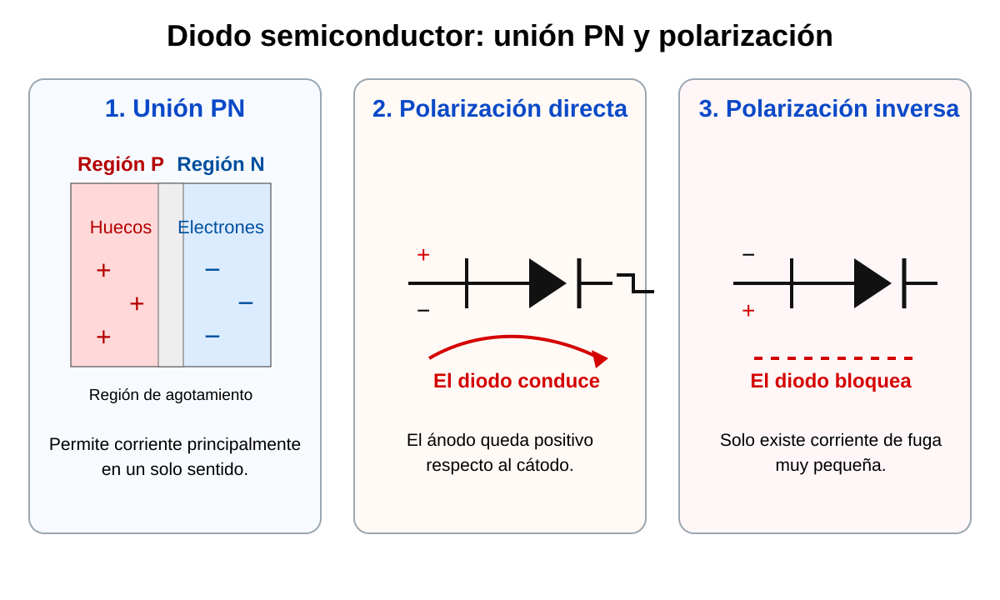
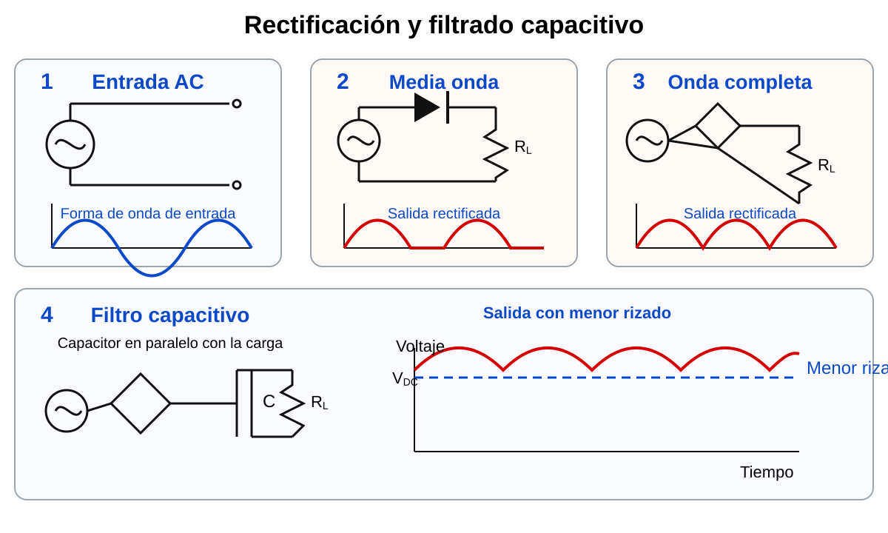

# Lab A01 – Fuente didáctica de ≈5,1 V con diodos

## Guía

- [Experiencia A01 – Diodos, rectificación, filtrado y regulación a ≈5,1 V](guia-lab-a01-diodos-rectificacion-zener.md)

## Reto central

Construir, calcular y comprobar por etapas una fuente didáctica para una carga digital pequeña:

```text
9 V RMS, 60 Hz
→ rectificación
→ puente de 4 diodos
→ filtro de 470 µF
→ Zener de 5,1 V
→ carga equivalente + LED
```

La experiencia distingue claramente tres funciones:

- el diodo de media onda bloquea un semiciclo;
- el puente convierte ambos semiciclos a la misma polaridad;
- el capacitor reduce el rizado y el Zener estabiliza la salida.

## Imágenes de apoyo

### Unión PN y polarización del diodo



### Rectificación y filtrado capacitivo



## Temas y mediciones

- Identificación de terminales y prueba rápida del diodo.
- LED con resistencia limitadora.
- Rectificación de media onda.
- Puente rectificador de onda completa.
- Filtrado capacitivo y rizado.
- Regulación con Zener de 5,1 V.
- Cálculo de `Vm`, `Vp`, `VDC`, `IDC`, `PIV`, `Vr(pp)`, `IR`, `IL`, `IZ` y potencia.
- Comparación entre teoría, simulación y medición.
- Diagnóstico por etapas.

## Seguridad esencial

Utilice solamente una fuente AC aislada de baja tensión. Nunca conecte la protoboard directamente a la red eléctrica y respete las referencias de tierra del osciloscopio.

## Entrega

Informe con cálculos, simulaciones, mediciones, análisis de error, diagnóstico y evidencias del montaje.
