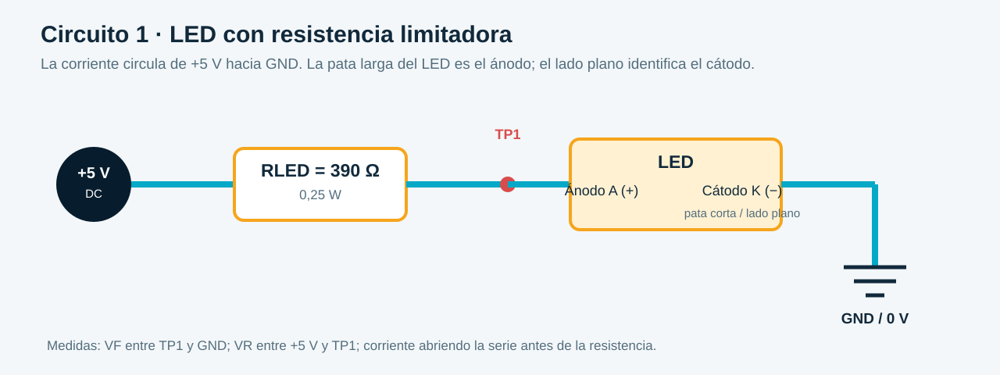
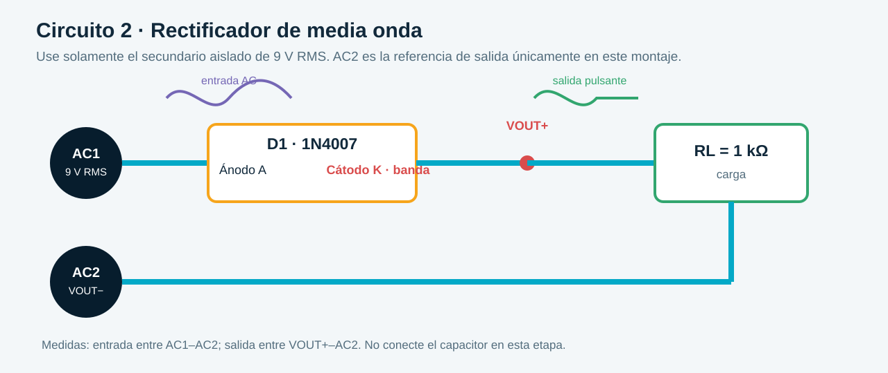
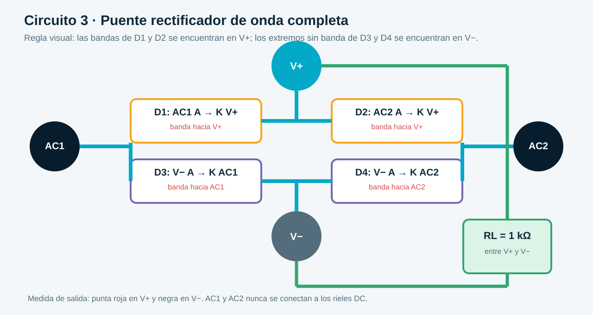
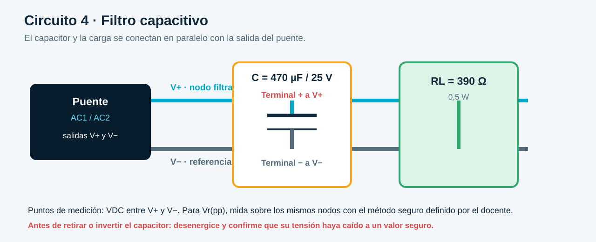
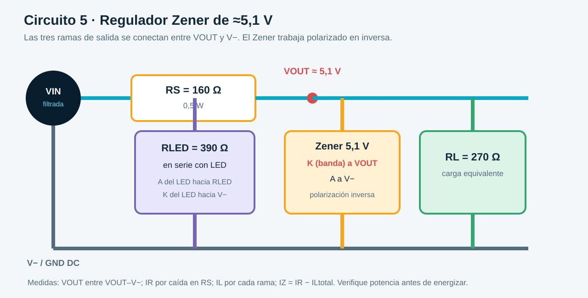

# EXPERIENCIA No. A01

# DIODOS, RECTIFICACIÓN, FILTRADO Y REGULACIÓN A ≈5,1 V

**Asignatura:** Electrónica Analógica y Digital  
**Periodo:** 2026-2  
**Programa:** Ingeniería Eléctrica  
**Duración estimada:** 3 horas presenciales + trabajo independiente  

---

## 1. RETO DE LA EXPERIENCIA

Construir, calcular y comprobar por etapas una fuente didáctica de aproximadamente `5,1 V DC` para una carga digital pequeña:

```text
9 V RMS, 60 Hz
      ↓
puente de 4 diodos
      ↓
filtro de 470 µF
      ↓
Zener de 5,1 V
      ↓
carga equivalente + LED indicador
```

La teoría básica del diodo, su polarización y su curva característica ya se estudió. En esta experiencia el énfasis estará en **calcular, montar, medir, comparar y diagnosticar**.

> **Aclaración:** `5,1 V` es la tensión aproximada de alimentación `VCC`. El nivel reconocido como HIGH depende de `VIH` y de la familia lógica utilizada. Antes de conectar un circuito digital real, consulte su hoja de datos.

---

## 2. OBJETIVOS

### Objetivo general

Implementar y analizar una fuente didáctica de aproximadamente `5,1 V DC` utilizando rectificación de onda completa, filtrado capacitivo y regulación básica con diodo Zener.

### Objetivos específicos

- Comprobar rápidamente la polaridad y caída directa de un diodo y un LED.
- Implementar un rectificador de media onda y relacionar su forma de onda con sus valores calculados.
- Implementar un puente rectificador y comprobar que ambos semiciclos aparecen con la misma polaridad en la carga.
- Diferenciar la función del puente de la función del capacitor.
- Calcular y medir tensión pico, tensión promedio, corriente de carga, frecuencia de rizado y PIV mínimo.
- Analizar el efecto de un capacitor de filtrado sobre el rizado.
- Diseñar y verificar un regulador Zener de `5,1 V` considerando corriente y potencia.
- Comparar valores teóricos, simulados y medidos.

---

## 3. SEGURIDAD

- Utilice únicamente una fuente AC **aislada**, de baja tensión y limitada a un máximo de `12 V RMS` para esta experiencia.
- **Nunca conecte la protoboard directamente a la red de 120 V o 230 V.**
- Desenergice el circuito antes de cambiar componentes, conexiones o polaridades.
- Descargue el capacitor antes de modificar el montaje.
- Verifique la polaridad del capacitor electrolítico, del LED y del Zener antes de energizar.
- Utilice siempre resistencia limitadora con el LED y el Zener.
- No alimente el circuito hasta que el docente o monitor revise el montaje.
- No toque conexiones energizadas y suspenda la prueba si un componente se calienta, cambia de color o produce olor.

### Precaución con el osciloscopio

En muchos osciloscopios de banco las pinzas de tierra de todos los canales están unidas entre sí y a tierra de protección. No conecte las tierras de dos sondas a nodos diferentes del puente. Para medir entre dos puntos flotantes utilice una sonda diferencial, un instrumento con canales aislados o el procedimiento definido por el docente. **Nunca elimine la conexión de tierra de protección del osciloscopio.**

Referencia de seguridad: [Keysight — Floating Measurement with Isolated Channel Oscilloscope](https://www.keysight.com/zz/en/assets/7018-03309/application-notes/5990-9777.pdf).

---

## 4. RECURSOS

### Componentes principales por grupo

- 4 diodos rectificadores `1N4007`.
- 1 diodo Zener `BZX55C5V1` de `5,1 V`, o un modelo equivalente **identificado exactamente**.
- 1 LED rojo, verde o amarillo.
- Resistencias de `160 Ω / 0,5 W`, `270 Ω / 0,25 W`, `390 Ω / 0,25 W`, `390 Ω / 0,5 W`, `470 Ω / 0,5 W` y `1 kΩ / 0,25 W`.
- 1 capacitor electrolítico de `470 µF / 25 V`.
- Capacitores de `100 µF / 25 V` y `1000 µF / 25 V` para comparación opcional.
- Protoboard y cables.

> Si no se dispone de `160 Ω`, puede utilizarse `150 Ω / 0,5 W`, pero deben repetirse los cálculos de corriente y potencia con el valor real.

### Equipos

- Fuente AC aislada de `9 V RMS`, `60 Hz`, o transformador didáctico equivalente.
- Fuente DC regulable para la caracterización opcional del Zener.
- Multímetro digital.
- Osciloscopio y sondas adecuadas, si están disponibles.
- Computador con Proteus, Multisim, LTspice, Falstad u otro simulador equivalente.

---

## 5. PREPARACIÓN ANTES DE ENERGIZAR

### 5.1 Revise las hojas de datos

Identifique para cada componente:

- ánodo, cátodo y marcas físicas;
- caída directa aproximada;
- corriente y potencia máximas;
- tensión inversa máxima del diodo rectificador;
- corriente de prueba y potencia máxima del Zener;
- polaridad y tensión nominal del capacitor.

El modelo `1N4007` se utilizará porque su capacidad de corriente y tensión inversa es muy superior a los valores de esta práctica. Aun así, el estudiante debe realizar el cálculo de selección.

### 5.2 Variables que se usarán

| Símbolo | Significado | Unidad |
|---|---|---|
| `VRMS` | valor eficaz de la entrada AC | V |
| `Vm` | valor pico de la señal de entrada | V |
| `Vp` | pico disponible en la carga después de las caídas en diodos | V |
| `VDC` | valor promedio o componente continua | V |
| `Vr(pp)` | rizado pico a pico: `Vmax − Vmin` | Vpp |
| `PIV` | tensión inversa pico que debe bloquear un diodo | V |
| `IDC` | corriente promedio en la carga rectificada | A o mA |
| `IL` | corriente total solicitada por la carga | A o mA |
| `IR` | corriente por la resistencia serie del Zener | A o mA |
| `IZ` | corriente que circula por el Zener | A o mA |
| `fr` | frecuencia del rizado | Hz |
| `C` | capacitancia del filtro | F |
| `RS` | resistencia serie del regulador Zener | Ω |
| `PZ` | potencia disipada por el Zener | W |

### 5.3 Mapa de fórmulas

#### Media onda, sin capacitor

```text
Vm = √2 · VRMS
Vp = Vm − VD
VDC ≈ 0,318 · Vp
IDC = VDC / RL
fr = f
PIVmín ≈ Vm
```

#### Puente de onda completa, sin capacitor

```text
Vm = √2 · VRMS
Vp = Vm − 2VD
VDC ≈ 0,636 · Vp
IDC = VDC / RL
fr = 2f
PIVmín por diodo ≈ Vm
```

#### Filtro capacitivo

```text
Vr(pp) ≈ IL / (fr · C)
VDC ≈ Vp − Vr(pp)/2
Vmin ≈ Vp − Vr(pp)
```

#### Regulador Zener

```text
IR = (Vin − Vout) / RS
IL = Vout / RL       [si la carga se representa mediante RL]
IR = IL + IZ
IZ = IR − IL
PZ = Vout · IZ
PRS = IR² · RS
```

> Las expresiones son aproximaciones del modelo práctico. Utilice el valor medido de `VD`, `Vout` y los valores reales de los componentes cuando estén disponibles.

### 5.4 Orden de trabajo

```text
calcular → revisar polaridad → montar sin energía → verificar → energizar → medir → comparar → diagnosticar
```

### 5.5 Convención de nodos y uso de la protoboard

Para que los diagramas, las tablas de conexión y el montaje físico usen el mismo lenguaje, se emplearán estos nombres:

| Nodo | Función |
|---|---|
| `AC1`, `AC2` | terminales de la fuente AC aislada |
| `V+`, `V−` | salida positiva y negativa del puente rectificador |
| `VFILT` | salida positiva después del filtro; eléctricamente corresponde a `V+` con el capacitor conectado |
| `VOUT` | salida regulada después de `RS` |

Organice la protoboard antes de insertar componentes:

- reserve dos filas independientes para `AC1` y `AC2`; **no las conecte a los rieles de alimentación**;
- use el riel rojo para `V+` o `VFILT` y el riel azul para `V−` solamente después de comprobar el puente;
- marque los nodos con cinta o etiquetas; no se indican números de fila porque cambian según el modelo de protoboard;
- recuerde que la **banda del 1N4007 y del Zener identifica el cátodo**;
- en el capacitor electrolítico, la franja marcada con signos `−` identifica el terminal negativo;
- en un LED común, la pata larga suele ser el ánodo y el lado plano del encapsulado identifica el cátodo. Confirme con el multímetro.

### 5.6 Lista de verificación antes de energizar

Solicite revisión del docente o monitor después de comprobar que:

- la fuente AC es aislada y no supera `12 V RMS`;
- `AC1` y `AC2` no están unidos entre sí ni conectados por error a `V+` o `V−`;
- las bandas de los cuatro diodos coinciden con el diagrama;
- el capacitor tiene su terminal positivo en `V+` y el negativo en `V−`;
- no existe continuidad directa entre `V+` y `V−` con el circuito desenergizado;
- el Zener está en inversa y todas las ramas tienen la resistencia indicada;
- el multímetro está configurado en la función y escala correctas antes de conectarlo.

---

## 6. PROCEDIMIENTO EXPERIMENTAL

### 6.1 Verificación rápida de componentes

1. Identifique la banda del cátodo en el `1N4007` y el Zener.
2. Identifique ánodo, cátodo y color del LED.
3. Identifique polaridad y tensión nominal del capacitor.
4. Utilice la función de prueba de diodos del multímetro y registre la caída directa del `1N4007` y del LED.

| Componente | Marca física | Caída directa medida | Observación |
|---|---|---:|---|
| 1N4007 | | | |
| LED | | | |
| Zener 5,1 V | | | |
| Capacitor | | no aplica | |

### 6.2 LED con resistencia limitadora

Conecte una fuente de `5 V DC`, un LED y una resistencia de `390 Ω`.



#### Conexiones

| Desde | Elemento | Hasta | Verificación |
|---|---|---|---|
| `+5 V` | resistencia `390 Ω` | ánodo del LED | la resistencia no tiene polaridad |
| ánodo del LED | LED | cátodo del LED | pata larga hacia la resistencia; lado plano hacia `GND` |
| cátodo del LED | cable | `GND` | no conecte el LED directamente a la fuente |

Puntos de medición: mida `VF` entre ánodo y cátodo del LED y la caída `VR` entre los extremos de la resistencia. La corriente puede medirse insertando el amperímetro **en serie**, nunca en paralelo con la fuente.

```text
ILED = (VS − VF) / RLED
PR = ILED² · RLED
```

1. Calcule `ILED` antes de montar.
2. Mida `VF`, la caída en la resistencia y la corriente.
3. Compare la corriente calculada y medida.

| VS | RLED | VF medido | ILED calculada | ILED medida |
|---:|---:|---:|---:|---:|
| 5 V | 390 Ω | | | |

### 6.3 Rectificador de media onda

**Datos de diseño:** `VRMS = 9 V`, `f = 60 Hz`, `VD ≈ 0,7 V`, `RL = 1 kΩ`.

Antes de montar, calcule en este orden:

```text
VRMS → Vm → Vp → VDC → IDC
```

Después determine `fr` y `PIVmín`.



#### Conexiones

| Desde | Elemento | Hasta | Verificación |
|---|---|---|---|
| `AC1` | cable | ánodo de `D1` | lado sin banda del `1N4007` |
| cátodo de `D1` | cable | `VOUT+` | la banda de `D1` queda hacia la carga |
| `VOUT+` | `RL = 1 kΩ` | `AC2` | `AC2` actúa como referencia de salida en este montaje |
| fuente AC aislada | terminal 1 y terminal 2 | `AC1` y `AC2` | no conecte ninguno a los rieles DC del puente |

Puntos de medición: entrada entre `AC1–AC2`; salida entre `VOUT+–AC2`. Si se usa osciloscopio, aplique la precaución indicada en la sección 3.

1. Implemente el rectificador con un `1N4007` y `RL`.
2. Observe entrada y salida utilizando el método de medición autorizado.
3. Compruebe que el semiciclo positivo aparece en la carga y que durante el negativo el diodo bloquea.
4. Registre valores y capturas.

| Magnitud | Teórico | Simulado | Medido | Unidad |
|---|---:|---:|---:|---|
| `VRMS` de entrada | 9 | | | V |
| `Vm` de entrada | 12,73 | | | V |
| `Vp` en la carga | 12,03 | | | V |
| `VDC` sin capacitor | 3,83 | | | V |
| `IDC` | 3,83 | | | mA |
| `fr` | 60 | | | Hz |
| `PIVmín` | 12,73 | | | V |

**Pregunta:** ¿por qué un pico de aproximadamente `12 V` produce solamente cerca de `3,83 V DC` promedio?

### 6.4 Rectificador de onda completa tipo puente

**Datos de diseño:** `VRMS = 9 V`, `f = 60 Hz`, `VD ≈ 0,7 V`, `RL = 1 kΩ`.



#### Conexiones del puente

| Diodo | Ánodo, lado sin banda | Cátodo, lado con banda |
|---|---|---|
| `D1` | `AC1` | `V+` |
| `D2` | `AC2` | `V+` |
| `D3` | `V−` | `AC1` |
| `D4` | `V−` | `AC2` |

Complete el montaje así:

| Desde | Elemento | Hasta |
|---|---|---|
| `V+` | `RL = 1 kΩ` | `V−` |
| terminal 1 de la fuente AC aislada | cable | `AC1` |
| terminal 2 de la fuente AC aislada | cable | `AC2` |

Antes de conectar la fuente, compruebe visualmente las dos uniones características del puente: en `V+` se encuentran **las dos bandas** de `D1` y `D2`; en `V−` se encuentran **los dos ánodos**, sin banda, de `D3` y `D4`.

Durante un semiciclo la trayectoria es `AC1 → D1 → V+ → RL → V− → D4 → AC2`. En el otro es `AC2 → D2 → V+ → RL → V− → D3 → AC1`. Por eso la corriente atraviesa la carga siempre de `V+` a `V−`.

Puntos de medición: entrada entre `AC1–AC2`; salida entre `V+–V−`.

1. Arme el puente utilizando cuatro diodos.
2. Identifique qué pareja conduce durante cada semiciclo.
3. Compruebe que la corriente atraviesa `RL` siempre en la misma dirección.
4. Observe que el puente produce pulsos positivos, pero **todavía no una línea horizontal**.
5. Registre valores y capturas.

| Magnitud | Teórico | Simulado | Medido | Unidad |
|---|---:|---:|---:|---|
| `Vm` de entrada | 12,73 | | | V |
| `Vp` después del puente | 11,33 | | | V |
| `VDC` sin capacitor | 7,21 | | | V |
| `IDC` | 7,21 | | | mA |
| `fr` | 120 | | | Hz |
| Caída total aproximada | 1,40 | | | V |
| `PIVmín` por diodo | 12,73 | | | V |

**Pregunta:** ¿por qué se necesitan cuatro diodos para mantener la misma polaridad en la carga y por qué eso todavía no elimina el rizado?

### 6.5 Filtro capacitivo

Sustituya temporalmente `RL` por una resistencia de carga de `390 Ω / 0,5 W` y conecte `470 µF / 25 V` en paralelo con ella.



#### Conexiones

Mantenga armado el puente de la sección anterior y realice estas conexiones con la fuente desconectada:

| Desde | Elemento o terminal | Hasta | Verificación |
|---|---|---|---|
| `V+` | cable | terminal positivo del capacitor `470 µF` | corresponde al terminal sin la franja `−` |
| terminal negativo del capacitor | cable | `V−` | la franja `−` queda hacia `V−` |
| `V+` | carga `390 Ω / 0,5 W` | `V−` | la carga queda en paralelo con el capacitor |

Puntos de medición: mida `VDC` y `Vr(pp)` entre `V+–V−`. Para observar mejor el rizado con osciloscopio, use acoplamiento AC si el procedimiento del equipo lo permite.

La resistencia de `390 Ω` hace que la corriente sea cercana a la carga total de diseño de `28 mA`.

1. Calcule `Vr(pp)`, `VDC` y `Vmin` antes de montar.
2. Conecte el capacitor respetando la polaridad.
3. Mida `VDC` con el multímetro y `Vr(pp)` con el osciloscopio.
4. Compare la señal pulsante del puente con la señal filtrada.
5. Descargue el capacitor antes de retirarlo.

| Carga y capacitor | `IL` | `VDC` esperado | `Vr(pp)` esperado | Medido |
|---|---:|---:|---:|---:|
| 390 Ω, sin capacitor | variable | 7,21 V aprox. | señal pulsante | |
| 390 Ω, 470 µF | ≈28 mA | ≈11,08 V | ≈0,50 Vpp | |

Como trabajo independiente, simule `100 µF` y `1000 µF` manteniendo la misma carga.

> Estos valores corresponden a la resistencia de prueba de `390 Ω`. Al conectar el regulador Zener, el capacitor también debe entregar `IZ`; por eso el rizado puede aumentar. Vuelva a medir `Vmax` y `Vmin` con el regulador conectado y utilice esos valores en el diseño final.

**Pregunta:** ¿qué elemento aprovecha ambos semiciclos y qué elemento sostiene la tensión entre los picos?

### 6.6 Regulador Zener de 5,1 V

Utilice como entrada la salida filtrada del puente.



**Valores de diseño:**

- `Vin,mín ≈ 10,83 V` como estimación inicial; utilice después el valor medido con el regulador conectado.
- `Vin,máx ≈ 11,33 V` como estimación inicial.
- `VZ = 5,1 V`.
- `IL,máx = 28 mA`.
- `IZ,mín = 5 mA`, sujeto a verificación en la hoja de datos.
- `RS = 160 Ω / 0,5 W`.

#### Conexiones

Conserve el puente y el capacitor. Retire la resistencia de prueba de `390 Ω / 0,5 W` utilizada en la sección 6.5 y conecte:

| Desde | Elemento | Hasta | Verificación |
|---|---|---|---|
| `VFILT` (`V+` del puente) | `RS = 160 Ω / 0,5 W` | `VOUT` | esta resistencia alimenta todas las ramas reguladas |
| `VOUT` | cátodo del Zener `5,1 V` | ánodo del Zener a `V−` | la banda del Zener queda hacia `VOUT` |
| `VOUT` | carga `RL = 270 Ω` | `V−` | primera rama en paralelo |
| `VOUT` | `RLED = 390 Ω` | ánodo del LED | segunda rama en paralelo |
| cátodo del LED | cable | `V−` | lado plano del LED hacia `V−` |

Puntos de medición:

- `Vin`: entre `VFILT–V−`;
- `Vout`: entre `VOUT–V−`;
- `IR`: mida la caída en `RS` y calcule `IR = VRS/RS`, o inserte el amperímetro en serie con `RS`;
- corriente en cada carga: mida la caída de su resistencia y aplique la Ley de Ohm;
- `IZ`: determine `IZ = IR − IL,total` y, si se requiere medición directa, inserte el amperímetro en serie con el Zener.

1. Conecte `RS` entre la salida filtrada y el nodo regulado.
2. Conecte el Zener en inversa: cátodo al nodo regulado y ánodo a tierra.
3. Primero mida `Vout` sin carga y verifique `IZ` y `PZ`.
4. Agregue una carga equivalente de `270 Ω`.
5. Agregue en paralelo la rama `390 Ω + LED`.
6. Mida `Vout`, `IR`, la corriente de carga y la corriente del Zener.
7. Compruebe las potencias de `RS`, Zener y resistencia del LED.

| Condición | `Vin` | `Vout` | `IR` | `IL` | `IZ` | `PZ` | ¿Regula? |
|---|---:|---:|---:|---:|---:|---:|---|
| Sin carga | | | | 0 | | | |
| Carga 270 Ω | | | | | | | |
| Carga 270 Ω + LED | | | | | | | |

> Si el Zener disponible no es BZX55C5V1, sustituya `IZ,mín` por el criterio apropiado de su hoja de datos y repita el diseño de `RS`.

### 6.7 Comprobación por etapas

| Punto | Qué medir | Valor esperado aproximado | Si falla, revise |
|---|---|---:|---|
| Secundario | `VRMS` en AC | 9 V RMS | fuente o transformador |
| Después del puente | `Vp` y forma de onda | 11,33 V pico | orientación de diodos |
| Después del capacitor | `VDC` y `Vr(pp)` | 11,08 V; 0,50 Vpp | polaridad, C y carga |
| Salida Zener | `Vout` DC | 5,1 V | `RS`, Zener y sobrecarga |
| LED | `ILED` o caída en R | 8 mA aprox. | polaridad y `RLED` |

No conecte todavía una compuerta real hasta verificar su tensión de alimentación permitida, su consumo y sus umbrales lógicos.

---

## 7. SIMULACIÓN Y TRABAJO INDEPENDIENTE

Antes o después de la sesión presencial, simule:

1. media onda;
2. puente de onda completa;
3. puente con `100 µF`, `470 µF` y `1000 µF`;
4. regulador Zener sin carga y con carga máxima;
5. una falla segura asignada por el docente.

### Evidencias mínimas

- Esquema con valores y polaridades.
- Forma de onda de entrada y salida de cada rectificador.
- Medición de `VDC` y `Vr(pp)` después del filtro.
- Corrientes `IR`, `IL` e `IZ` en el regulador.
- Captura de la falla y medición que permitió localizarla.

---

## 8. ANÁLISIS DE DATOS

Responda con evidencia de cálculo y medición:

1. ¿Por qué la media onda elimina un semiciclo y conserva el otro?
2. ¿Qué parejas de diodos conducen en cada semiciclo del puente?
3. ¿Por qué el puente requiere cuatro diodos?
4. ¿Por qué la salida del puente todavía es pulsante?
5. ¿Por qué el capacitor, y no los cuatro diodos, vuelve la salida casi horizontal?
6. ¿Cómo cambia el rizado al duplicar la frecuencia de rectificación?
7. ¿Cómo cambia el rizado al aumentar `C` o reducir `IL`?
8. ¿Por qué deben distinguirse `IR`, `IL` e `IZ`?
9. ¿Qué ocurre si `IZ` cae por debajo de la región de regulación?
10. ¿Por qué `5,1 V` de alimentación no significa automáticamente que cualquier entrada lógica sea HIGH?
11. ¿Qué diferencia se encontró entre teoría, simulación y medición?
12. ¿Qué medición permitió localizar una falla del montaje?

Para cada magnitud principal calcule:

```text
error porcentual = |medido − teórico| / |teórico| · 100 %
```

---

## 9. CÁLCULOS OBLIGATORIOS

1. `Vm`, `Vp`, `VDC`, `IDC`, `fr` y `PIVmín` de media onda.
2. `Vp`, `VDC`, `IDC`, `fr` y `PIVmín` del puente.
3. `Vr(pp)`, `VDC` y `Vmin` con `470 µF`.
4. Valor máximo y valor comercial seleccionado de `RS`.
5. `IR`, `IL`, `IZ`, `PZ` y `PRS` sin carga y con carga.
6. `RLED`, `ILED` y potencia de la resistencia del LED.
7. Error porcentual entre teoría y medición.

---

## 10. ALCANCE PRESENCIAL DE TRES HORAS

### Obligatorio durante la sesión

- revisión de seguridad y fórmulas;
- prueba rápida de diodo y LED;
- media onda;
- puente;
- filtro de `470 µF`;
- Zener y LED;
- mediciones por etapas.

### Trabajo independiente

- comparación de los tres capacitores;
- simulaciones completas;
- análisis de error;
- informe y preguntas de profundización.

No es necesario construir físicamente los tres valores de capacitor durante la misma sesión si el tiempo o los equipos son limitados.

---

## 11. EVIDENCIAS E INFORME

El informe debe incluir:

- datos iniciales y fórmulas utilizadas;
- esquemas con valores y puntos de medición;
- una fotografía legible del montaje final en protoboard, con los nodos principales identificados;
- las tablas de conexión de esta guía marcadas o comentadas si se realizó algún cambio autorizado;
- tablas teóricas, simuladas y medidas;
- capturas de formas de onda;
- cálculos de corriente, potencia y PIV;
- error porcentual y posibles causas;
- evidencia de una falla y su diagnóstico;
- conclusión sobre si la fuente puede alimentar la carga propuesta;
- advertencia sobre las limitaciones del Zener como regulador didáctico.

Las conclusiones deben responder a los objetivos y no limitarse a afirmar que “la práctica funcionó”.

---

## 12. BIBLIOGRAFÍA Y HOJAS DE DATOS

- Boylestad, R. y Nashelsky, L. *Electrónica: teoría de circuitos y dispositivos electrónicos*, 10.ª edición.
- [Referencia Boylestad para el Corte 1](../../../referencias/BOYLESTAD_CORTE_1.md).
- [onsemi — 1N4001 a 1N4007](https://www.onsemi.com/download/data-sheet/pdf/1n4001-d.pdf).
- [Vishay — BZX55 Series](https://www.vishay.com/docs/85604/bzx55.pdf).
- Hoja de datos del LED utilizado.
- Hoja de datos del capacitor utilizado.
