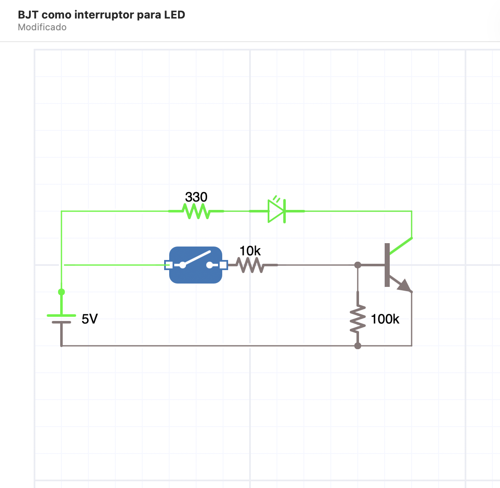
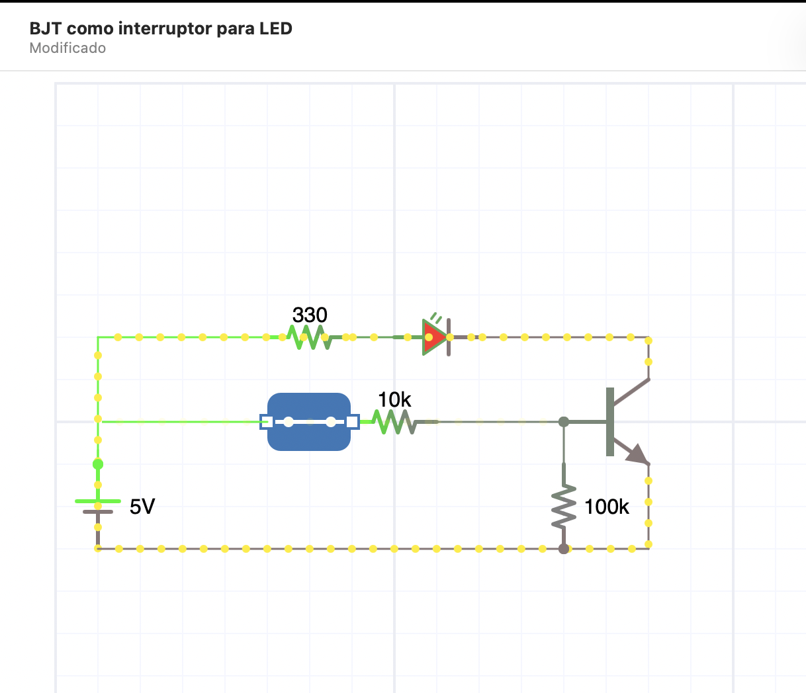
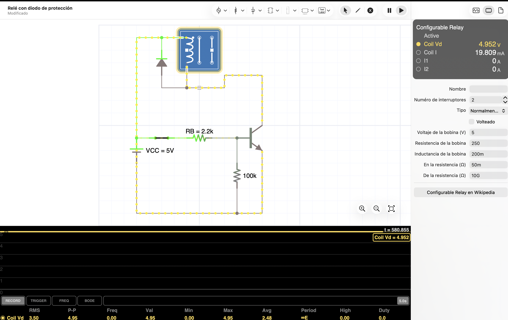
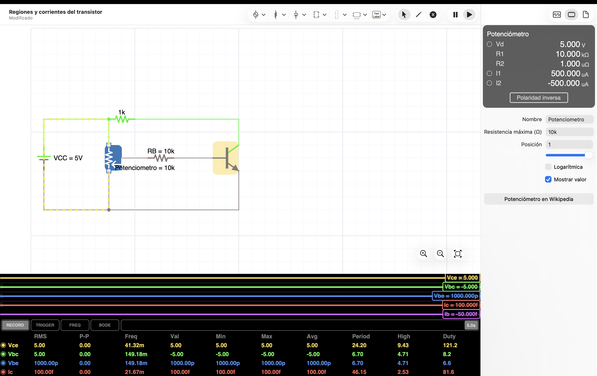
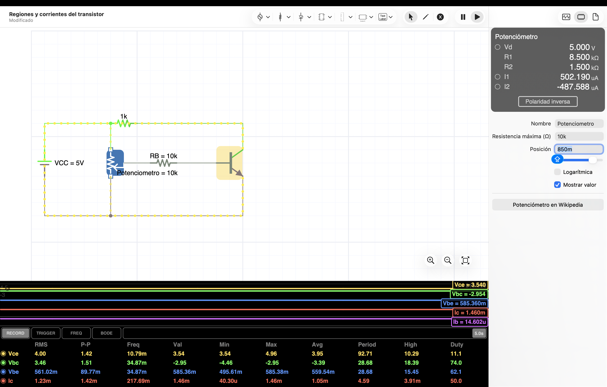
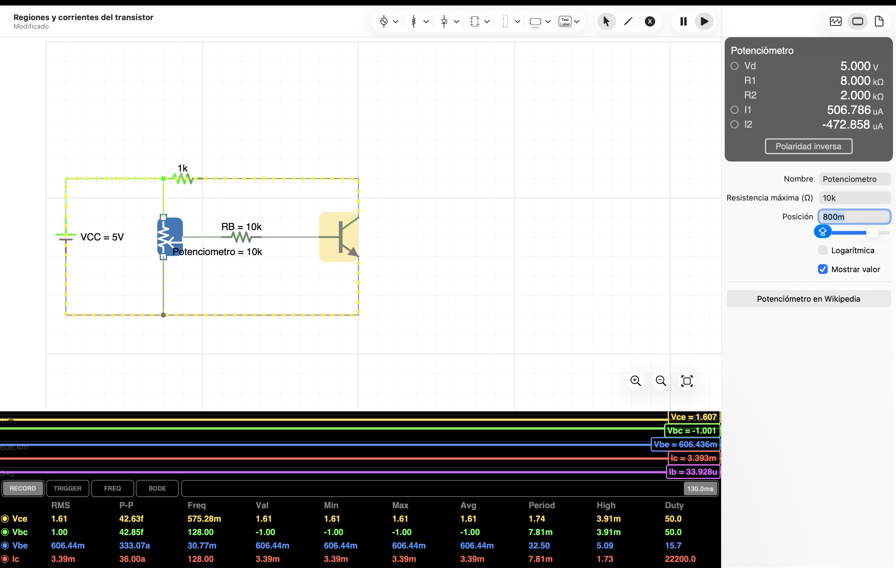
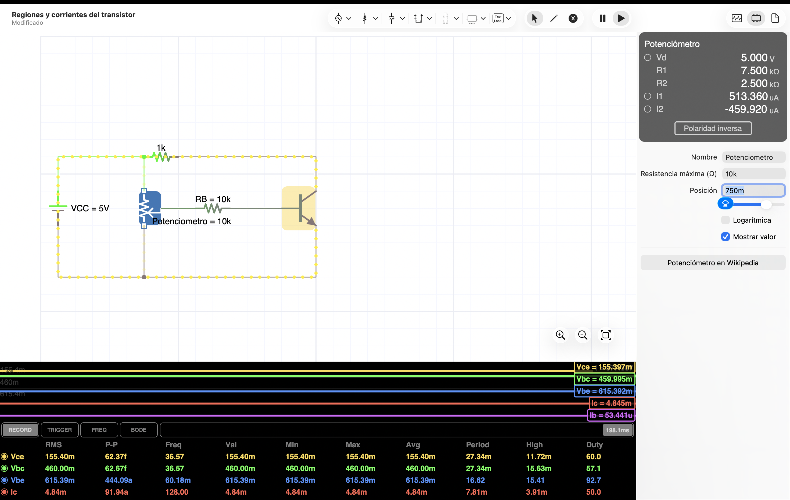
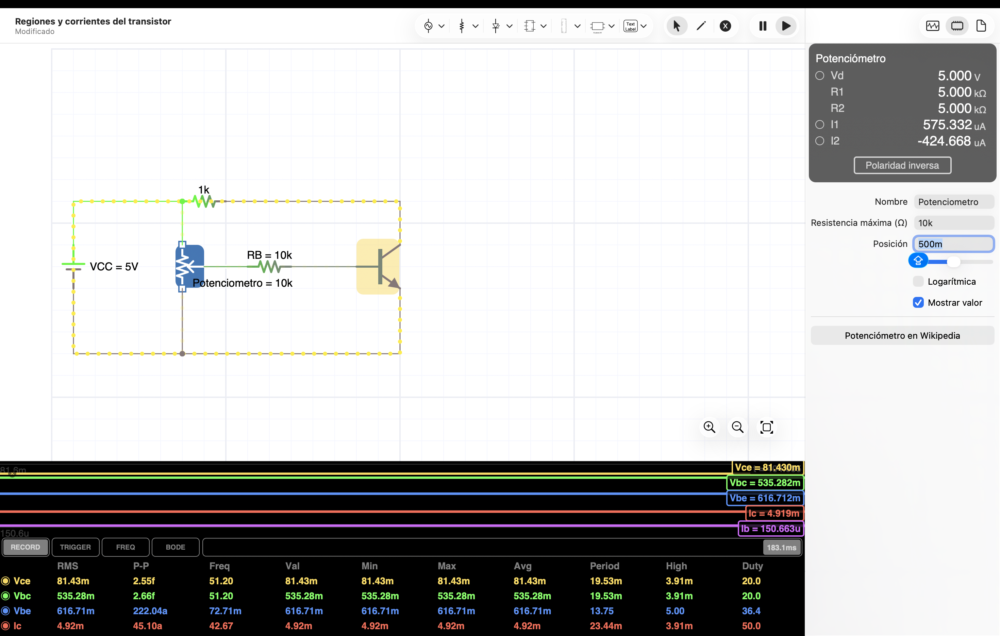
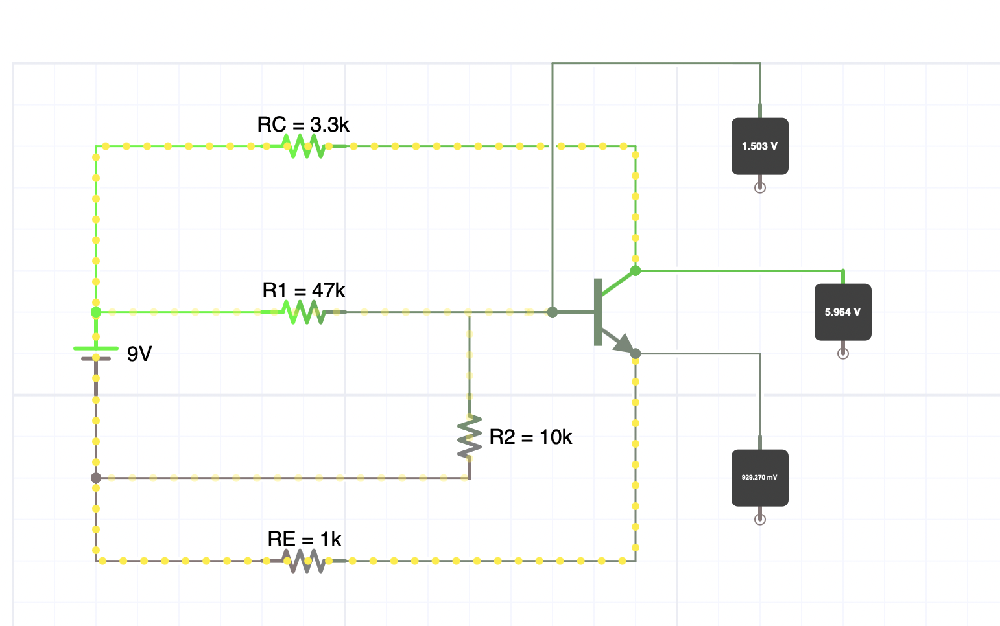
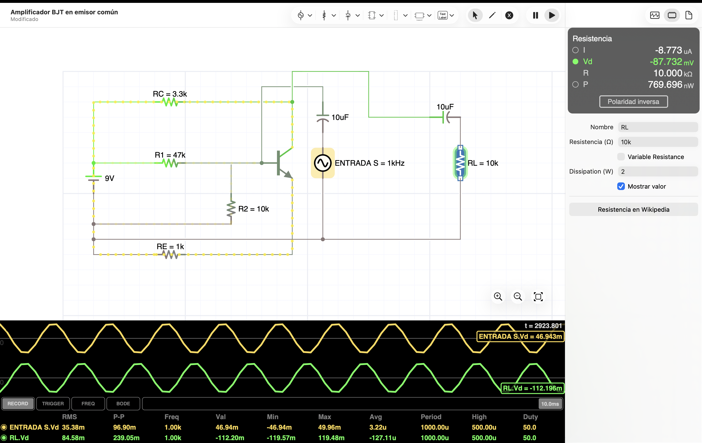

# EXPERIENCIA No. A02

# TRANSISTOR BJT COMO INTERRUPTOR Y AMPLIFICADOR BÁSICO

**Asignatura:** Electrónica Analógica y Digital  
**Periodo:** 2026-2  
**Programa:** Ingeniería Eléctrica  

---

## 1. INTRODUCCIÓN

El transistor bipolar de unión, conocido como BJT por sus siglas en inglés, es uno de los dispositivos semiconductores más importantes en la electrónica analógica y digital. Está formado por tres terminales: base, colector y emisor. Dependiendo de la forma en que se polarice, puede funcionar como interruptor electrónico, amplificador de señal o elemento de control de corriente.

En aplicaciones de ingeniería eléctrica, el transistor BJT se utiliza para activar cargas de baja y mediana potencia, adaptar señales de control, manejar relés, encender indicadores, controlar pequeñas cargas DC y construir etapas básicas de amplificación. Su principio de funcionamiento se basa en que una pequeña corriente aplicada en la base puede controlar una corriente mayor entre colector y emisor.

En esta experiencia se estudiará el transistor BJT principalmente como interruptor electrónico. Se analizarán las regiones de corte y saturación, el cálculo de la resistencia de base, la activación de un LED, el control de una carga y el uso del diodo de protección en cargas inductivas. Finalmente, se realizará una aproximación al transistor como amplificador básico en configuración de emisor común.

---

## 2. OBJETIVO

Implementar y analizar circuitos básicos con transistor BJT, verificando su funcionamiento como interruptor electrónico y observando su comportamiento en una configuración elemental de amplificación.

### Objetivos específicos

- Identificar los terminales base, colector y emisor de un transistor BJT.
- Diferenciar transistores NPN y PNP a partir de su símbolo y hoja de datos.
- Comprobar las regiones de corte y saturación del transistor.
- Calcular la resistencia de base para activar una carga mediante un BJT.
- Implementar un circuito con BJT para encender un LED.
- Implementar un circuito con BJT para activar una carga DC.
- Analizar el uso del diodo de protección en cargas inductivas.
- Observar el comportamiento de un amplificador básico en emisor común.
- Comparar resultados teóricos, simulados y medidos.

---

## 3. NORMATIVA DE SEGURIDAD

Es obligatorio cumplir las normas de seguridad del laboratorio durante toda la práctica.

**PELIGRO:** Riesgo de choque eléctrico al manipular fuentes de alimentación. Asegúrese de que el equipo esté apagado antes de realizar cualquier conexión.

**AVISO:** Riesgo de daño al transistor si se excede la corriente máxima de base, colector o la potencia permitida. Revise la hoja de datos antes de energizar el circuito.

**PRECAUCIÓN:** Las resistencias, transistores o cargas pueden calentarse si circula demasiada corriente o si se conectan incorrectamente.

**ELEMENTOS DE PROTECCIÓN PERSONAL:** Bata de laboratorio y gafas de seguridad cuando el laboratorio lo exija.

### Recomendaciones de seguridad

- Verifique el pinout del transistor antes de conectarlo.
- No conecte directamente la base del transistor a la fuente sin resistencia limitadora.
- No alimente el circuito hasta revisar las conexiones.
- Verifique la polaridad del diodo de protección cuando se utilicen cargas inductivas.
- No exceda el voltaje ni la corriente recomendada para el transistor.
- Desconecte la alimentación antes de modificar el circuito.

---

## 4. RECURSOS

### Materiales o dispositivos

- Transistor BJT NPN 2N2222, PN2222, BC547 o equivalente.
- Transistor BJT PNP, opcional para comparación.
- Diodo 1N4007 o 1N4148.
- LED rojo, verde o amarillo.
- Resistencias de 220 Ω, 330 Ω, 1 kΩ, 2.2 kΩ, 4.7 kΩ, 10 kΩ y 100 kΩ.
- Potenciómetro de 10 kΩ, opcional.
- Relé de 5 V o 12 V, si está disponible.
- Motor DC pequeño o carga resistiva, si está disponible.
- Capacitores de 1 µF, 10 µF o 100 µF para la etapa de amplificación, si aplica.
- Protoboard.
- Cables de conexión.

### Herramientas

- Pinzas de punta.
- Cortafrío, si se requiere.
- Computador con software de simulación.

### Equipos

- Fuente de corriente directa DC.
- Multímetro digital.
- Osciloscopio, si está disponible.
- Generador de funciones, si está disponible.

### Software sugerido

- Proteus.
- Multisim.
- Tinkercad Circuits.
- Falstad Circuit Simulator.
- LTspice u otro simulador equivalente.

---

## 5. RECOMENDACIÓN PREVIA

Antes de realizar la práctica, el estudiante debe consultar la hoja de datos del transistor que utilizará en el laboratorio.

Debe identificar:

- Tipo de transistor: NPN o PNP.
- Distribución de terminales: base, colector y emisor.
- Corriente máxima de colector.
- Voltaje máximo colector-emisor.
- Ganancia de corriente aproximada, conocida como beta o hFE.
- Potencia máxima de disipación.

Complete la siguiente tabla antes de iniciar el montaje.

| Transistor | Tipo | Pin 1 | Pin 2 | Pin 3 | IC máxima | VCE máxima | hFE aproximado |
|---|---|---|---|---|---:|---:|---:|
| 2N2222 / PN2222 / BC547 | | | | | | | |

---

## 6. PROCEDIMIENTO EXPERIMENTAL

### 6.1 Identificación de terminales del transistor

1. Observe físicamente el transistor.
2. Identifique la referencia impresa en el encapsulado.
3. Consulte el datasheet del componente.
4. Dibuje la vista frontal del transistor e indique base, colector y emisor.
5. Compare el símbolo del transistor NPN con el símbolo del transistor PNP.

#### Tabla 1. Identificación del transistor

| Parámetro | Información encontrada |
|---|---|
| Referencia del transistor | |
| Tipo NPN o PNP | |
| Terminal base | |
| Terminal colector | |
| Terminal emisor | |
| Encapsulado | |
| Aplicación típica | |

---

### 6.2 Circuito 1: BJT NPN como interruptor para LED

Arme un circuito donde el transistor BJT NPN controle el encendido de un LED conectado al colector.

**Valores sugeridos:**

- Fuente de alimentación: 5 V DC.
- Transistor: 2N2222, PN2222 o BC547.
- Resistencia del LED: 330 Ω.
- Resistencia de base: 10 kΩ inicialmente.

#### Referencia en iCircuit



*Figura A02-1. Interruptor abierto: la resistencia de 100 kΩ mantiene la base en 0 V, el transistor permanece en corte y el LED está apagado.*



*Figura A02-2. Interruptor cerrado: circula corriente por la resistencia de base de 10 kΩ, el transistor entra en saturación y el LED enciende.*

#### Procedimiento

1. Conecte el emisor del transistor al negativo de la fuente, que será el nodo común `GND`.
2. Conecte `+5 V → resistencia de 330 Ω → ánodo del LED`.
3. Conecte el cátodo del LED al colector del transistor.
4. Conecte `+5 V → interruptor S1 → resistencia de 10 kΩ → base`.
5. Conecte una resistencia de `100 kΩ` entre base y `GND` para evitar que la base quede flotante.
6. Con S1 abierto, mida `VBE`, `VCE`, `IB` e `IC`; compruebe que el LED está apagado.
7. Cierre S1 y repita las mediciones; compruebe que el LED enciende.
8. Compare ambos estados e identifique corte y saturación.

#### Tabla 2. BJT como interruptor para LED

| Condición de base | VBE | VCE | Estado del LED | Región estimada del transistor |
|---|---:|---:|---|---|
| Base desconectada o en 0 V | | | | |
| Base con resistencia a 5 V | | | | |

---

### 6.3 Circuito 2: Variación de la resistencia de base

Repita el circuito anterior usando diferentes resistencias de base.

**Valores sugeridos:**

- RB1 = 100 kΩ.
- RB2 = 10 kΩ.
- RB3 = 4.7 kΩ.
- RB4 = 1 kΩ.

#### Procedimiento

1. Cambie la resistencia de base.
2. Mida VBE.
3. Mida VCE.
4. Calcule la corriente de base.
5. Observe el brillo del LED.
6. Determine si el transistor se encuentra en corte, activa o saturación.

#### Tabla 3. Efecto de la resistencia de base

| RB | VBE | VCE | IB calculada | Estado del LED | Región estimada |
|---:|---:|---:|---:|---|---|
| 100 kΩ | | | | | |
| 10 kΩ | | | | | |
| 4.7 kΩ | | | | | |
| 1 kΩ | | | | | |

### Cálculo sugerido

```text
IB = (VIN - VBE) / RB
```

Donde:

- IB es la corriente de base.
- VIN es el voltaje aplicado a la resistencia de base.
- VBE es el voltaje base-emisor.
- RB es la resistencia de base.

---

### 6.4 Circuito 3: Control de carga DC con transistor

Utilice el transistor BJT para controlar una carga diferente al LED, como un motor DC pequeño, una lámpara de baja tensión o una resistencia de carga.

**Valores sugeridos:**

- Fuente: 5 V o 9 V DC, según la carga.
- Transistor: 2N2222 o equivalente.
- Resistencia de base: 1 kΩ o 4.7 kΩ.
- Carga: motor DC pequeño o resistencia.

#### Procedimiento

1. Conecte el transistor como interruptor en configuración de lado bajo.
2. Conecte la carga entre VCC y colector.
3. Conecte el emisor a tierra.
4. Aplique señal de control en la base mediante resistencia.
5. Mida VBE.
6. Mida VCE.
7. Mida o calcule la corriente de la carga.
8. Analice si el transistor está saturado.

#### Tabla 4. Control de carga DC

| Carga utilizada | VCC | RB | VBE | VCE | Corriente de carga | Estado de la carga |
|---|---:|---:|---:|---:|---:|---|
| | | | | | | |

---

### 6.5 Circuito 4: Activación de relé con diodo de protección

Implemente el accionamiento de un relé de 5 V mediante un transistor BJT NPN conectado como interruptor de lado bajo. El diodo de protección debe quedar en paralelo con la bobina y normalmente polarizado en inversa.

#### Referencia en iCircuit



*Figura A02-3. Relé configurable activo. La bobina recibe 4,952 V y conduce aproximadamente 19,8 mA. El cátodo del diodo —lado marcado con la barra— está conectado a +5 V y el ánodo al colector.*

#### Configuración sugerida en iCircuit

- Componente: `Configurable Relay`.
- Tipo: normalmente abierto (`NO`).
- Número de interruptores: uno es suficiente para la práctica.
- Voltaje de bobina: `5 V`.
- Resistencia de bobina: `250 Ω`.
- Inductancia de bobina: `200 mH`.
- Transistor: BJT NPN.
- Resistencia de base: `2,2 kΩ`.
- Resistencia base-emisor: `100 kΩ`.

#### Conexiones

1. Conecte el terminal superior de la bobina a `+5 V`.
2. Conecte el terminal inferior de la bobina al colector del transistor.
3. Conecte el emisor al negativo de la fuente o nodo común `GND`.
4. Conecte `+5 V → interruptor S1 → resistencia de 2,2 kΩ → base`.
5. Conecte una resistencia de `100 kΩ` entre base y `GND`.
6. Conecte el diodo en paralelo con la bobina: cátodo o barra hacia `+5 V` y ánodo hacia el colector.
7. No agregue una resistencia externa de bobina en la simulación si utiliza el relé configurable; el modelo ya incorpora `250 Ω`.
8. Active S1, compruebe el accionamiento del relé y registre `VBE`, `VCE`, voltaje y corriente de bobina.
9. Abra S1 y explique cómo el diodo proporciona un camino temporal para la corriente de la bobina y limita la sobretensión sobre el transistor.

> En el montaje físico se debe verificar en la hoja de datos la tensión, resistencia y corriente nominal de la bobina. No todos los relés de 5 V tienen los mismos valores.

#### Tabla 5. Activación de relé

| Condición de base | VBE | VCE | Estado del relé | Observación |
|---|---:|---:|---|---|
| Base en 0 V | | | | |
| Base activada | | | | |

### Pregunta clave

¿Qué función cumple el diodo conectado en paralelo con la bobina del relé?

---

### 6.6 Circuito 5: Regiones de operación y corrientes del transistor

Utilice un potenciómetro como divisor de voltaje para variar progresivamente la excitación de base y reconocer las regiones de corte, activa y saturación.

#### Valores y conexiones

- Fuente: `VCC = 5 V`.
- Resistencia de colector: `RC = 1 kΩ`.
- Potenciómetro: `10 kΩ`.
- Resistencia fija de base: `RB = 10 kΩ`.
- Transistor: BJT NPN con `β ≈ 100` en la simulación.
- Conecte `+5 V → RC → colector`.
- Conecte el emisor al negativo común `GND`.
- Conecte los extremos del potenciómetro entre `+5 V` y `GND`.
- Conecte `cursor del potenciómetro → RB → base`. No conecte el cursor directamente a la base.

En iCircuit, la posición `1,00` sitúa el cursor cerca de `0 V`, mientras que la posición `0` lo acerca a `+5 V`. Por ello, el recorrido debe comenzar en `1,00` y disminuir gradualmente.

#### Referencias en iCircuit



*Figura A02-4. Corte: VBE prácticamente nulo, IC prácticamente nula y VCE igual a 5 V.*



*Figura A02-5. Región activa: IB = 14,602 µA, IC = 1,460 mA y VCE = 3,540 V. Se conserva aproximadamente IC = β·IB.*



*Figura A02-6. Región activa próxima al límite: IB = 33,928 µA, IC = 3,393 mA y VCE = 1,607 V.*



*Figura A02-7. Inicio de saturación: VCE disminuye a 0,155 V y VBC se vuelve positivo; la corriente de colector se aproxima al máximo permitido por RC.*



*Figura A02-8. Saturación profunda: aunque IB aumenta a 150,663 µA, IC solo alcanza 4,919 mA porque queda limitada por VCC y RC.*

#### Barrido observado en la simulación

| Posición | VBE | VBC | VCE | IB | IC | IE ≈ IB + IC | Región |
|---:|---:|---:|---:|---:|---:|---:|---|
| 1,00 | ≈ 0 V | −5,000 V | 5,000 V | ≈ 0 A | ≈ 0 A | ≈ 0 A | Corte |
| 0,90 | 0,496 V | −4,464 V | 4,960 V | 0,403 µA | 40,30 µA | 40,70 µA | Transición / activa débil |
| 0,85 | 0,585 V | −2,954 V | 3,540 V | 14,602 µA | 1,460 mA | 1,475 mA | Activa |
| 0,80 | 0,606 V | −1,001 V | 1,607 V | 33,928 µA | 3,393 mA | 3,427 mA | Activa |
| 0,75 | 0,615 V | +0,460 V | 0,155 V | 53,441 µA | 4,845 mA | 4,898 mA | Saturación |
| 0,50 | 0,617 V | +0,535 V | 0,081 V | 150,663 µA | 4,919 mA | 5,070 mA | Saturación profunda |

Los valores corresponden al modelo usado en iCircuit y deben compararse con las mediciones del transistor físico. La posición exacta de cada transición puede cambiar por la dispersión de `β` y `VBE`.

#### Procedimiento

1. Revise que la resistencia `RB = 10 kΩ` esté realmente entre el cursor y la base.
2. Ajuste el potenciómetro en `1,00` antes de energizar.
3. Registre `VBE`, `VBC`, `VCE`, `IB` e `IC`.
4. Disminuya la posición a `0,90`, `0,85`, `0,80`, `0,75` y `0,50`, registrando los valores después de estabilizar cada condición.
5. Calcule `IE = IB + IC` y, cuando corresponda, `β = IC/IB`.
6. Identifique corte cuando `IB` e `IC` sean prácticamente nulas y `VCE ≈ VCC`.
7. Identifique región activa cuando `VBC < 0` y se cumpla aproximadamente `IC = β·IB`.
8. Identifique saturación cuando `VBC > 0`, `VCE` sea pequeño y el aumento de `IB` produzca poca variación adicional de `IC`.
9. Explique por qué la corriente de colector se aproxima a `(VCC − VCE(sat))/RC` durante la saturación.

#### Tabla para el montaje físico

| Posición o voltaje del cursor | VBE | VBC | VCE | IB | IC | IE | β = IC/IB | Región |
|---:|---:|---:|---:|---:|---:|---:|---:|---|
| | | | | | | | | |
| | | | | | | | | |
| | | | | | | | | |

---

### 6.7 Circuito 6: Amplificador básico en emisor común

Implemente una etapa amplificadora en emisor común y compruebe el punto de operación, la ganancia de voltaje y la inversión de fase. En esta configuración, la resistencia de emisor permanece sin capacitor de derivación para conservar realimentación negativa y estabilidad.

#### Valores utilizados

- Fuente: `VCC = 9 V`.
- Transistor: BJT NPN con `β = 100` en iCircuit.
- Resistencia de colector: `RC = 3,3 kΩ`.
- Resistencia de emisor: `RE = 1 kΩ`.
- Divisor de polarización: `R1 = 47 kΩ` y `R2 = 10 kΩ`.
- Capacitor de entrada: `Cin = 10 µF`.
- Capacitor de salida: `Cout = 10 µF`.
- Carga: `RL = 10 kΩ`.
- Entrada: senoidal, `1 kHz`, amplitud `50 mV` y offset DC `0 V`.

#### Conexiones

1. Conecte `+9 V → RC → colector`.
2. Conecte el emisor a `RE` y el otro terminal de `RE` al nodo común `GND`.
3. Conecte `R1` entre `+9 V` y la base.
4. Conecte `R2` entre la base y `GND`.
5. Conecte el negativo del generador a `GND`.
6. Conecte `generador positivo → terminal negativo de Cin → terminal positivo de Cin → base`.
7. Conecte `colector → terminal positivo de Cout → terminal negativo de Cout → VOUT`.
8. Conecte `RL` entre `VOUT` y `GND`.
9. No conecte un capacitor en paralelo con `RE` durante esta experiencia.

> En el símbolo empleado, la placa recta representa el terminal positivo y la placa curva el terminal negativo del capacitor electrolítico.

#### Verificación del punto de operación DC



*Figura A02-9. Punto de operación antes de evaluar la señal: VB = 1,503 V, VE = 0,929 V y VC = 5,964 V.*

A partir de estas mediciones:

```text
VBE = VB - VE = 1,503 V - 0,929 V = 0,574 V
VCE = VC - VE = 5,964 V - 0,929 V = 5,035 V
IE  = VE / RE ≈ 0,929 mA
IC  = (VCC - VC) / RC ≈ 0,920 mA
IB  ≈ IC / β ≈ 9,20 µA
```

Como `VBC < 0` y `VCE` se mantiene lejos de la saturación, el transistor está polarizado en región activa y dispone de margen para amplificar sin recortar la señal.

#### Señales de entrada y salida



*Figura A02-10. Entrada amarilla y salida verde sobre RL. Ambas señales tienen 1 kHz; la salida está amplificada e invertida.*

#### Resultados de la simulación

| Magnitud | Entrada | Salida sobre RL |
|---|---:|---:|
| Frecuencia | 1,00 kHz | 1,00 kHz |
| Valor pico a pico | 96,90 mV | 239,05 mV |
| Valor RMS | 35,38 mV | 84,58 mV |
| Valor promedio | ≈ 0 V | ≈ 0 V |
| Relación de fase | Referencia | Invertida 180° |

La ganancia medida con valores pico a pico es:

```text
AV = -Vout(pp) / Vin(pp)
AV = -239,05 mV / 96,90 mV
AV ≈ -2,47
```

El signo negativo representa la inversión de fase propia del emisor común. Los capacitores `Cin` y `Cout` permiten el paso de la componente alterna y separan los niveles DC de la fuente, la polarización del transistor y la carga.

#### Procedimiento

1. Arme primero la red de polarización sin el generador y sin `RL`.
2. Mida `VB`, `VE`, `VC`, `VBE` y `VCE`; confirme que el transistor se encuentra en región activa.
3. Desenergice el circuito y conecte `Cin`, el generador, `Cout` y `RL`, respetando la polaridad indicada.
4. Configure la entrada a `1 kHz`, `50 mV` de amplitud y `0 V` de offset.
5. Observe simultáneamente `VIN` y el voltaje sobre `RL`.
6. Registre frecuencia, valor RMS y valor pico a pico de ambas señales.
7. Calcule la ganancia y compruebe la inversión de fase.
8. Aumente lentamente la amplitud de entrada y determine cuándo comienza el recorte; luego regrese a `50 mV`.
9. Compare los valores simulados con las mediciones del montaje físico.

#### Tabla 7. Amplificador básico

| Procedencia | Vin(pp) | Vout(pp) | Frecuencia | AV | ¿Salida invertida? | Observación |
|---|---:|---:|---:|---:|---|---|
| iCircuit | 96,90 mV | 239,05 mV | 1,00 kHz | −2,47 | Sí | Señales sin recorte apreciable |
| Montaje físico | | | | | | |

---

## 7. SIMULACIÓN DE CIRCUITOS

Realice la simulación de los siguientes circuitos en el software de su preferencia:

1. BJT como interruptor para LED.
2. Variación de resistencia de base.
3. Control de carga DC con BJT.
4. Activación de relé con diodo de protección, si el software lo permite.
5. Medición de corrientes IB, IC e IE.
6. Amplificador básico en emisor común.

### Evidencias mínimas de simulación

- Captura del circuito.
- Captura de mediciones de VBE y VCE.
- Captura del estado de la carga activada y desactivada.
- Captura de la señal de entrada y salida en el amplificador, si aplica.

---

## 8. ANÁLISIS DE DATOS

Responda en el informe:

1. ¿Qué ocurre cuando la base del transistor no recibe corriente?
2. ¿Qué ocurre cuando la base recibe corriente suficiente?
3. ¿Qué valores de VBE se obtuvieron en conducción?
4. ¿Qué valor de VCE indica que el transistor está saturado?
5. ¿Cómo afecta la resistencia de base al funcionamiento del transistor?
6. ¿Por qué no se debe conectar la base directamente a la fuente?
7. ¿Qué función cumple el transistor en el control de una carga?
8. ¿Qué función cumple el diodo de protección en el relé?
9. ¿Qué diferencia existe entre usar el transistor como interruptor y como amplificador?
10. ¿Qué diferencias se encontraron entre teoría, simulación y medición?

---

## 9. CÁLCULOS SOLICITADOS

Incluya los siguientes cálculos en el informe:

1. Corriente de base para cada resistencia utilizada.
2. Corriente del LED o carga.
3. Corriente de colector.
4. Corriente de emisor aproximada.
5. Ganancia aproximada beta.
6. Potencia disipada en el transistor.
7. Potencia disipada en la resistencia de base.
8. Ganancia de voltaje del amplificador, si se implementa o simula.

### Fórmulas de referencia

```text
IB = (VIN - VBE) / RB
```

```text
IC = (VCC - VCE) / RC
```

```text
β ≈ IC / IB
```

```text
IE ≈ IC + IB
```

```text
PTRANSISTOR ≈ VCE × IC
```

```text
AV = Vout / Vin
```

---

## 10. PREGUNTAS DE PROFUNDIZACIÓN

1. ¿Por qué el transistor BJT puede funcionar como interruptor electrónico?
2. ¿Qué diferencia existe entre corte, región activa y saturación?
3. ¿Por qué se usa una resistencia en la base del transistor?
4. ¿Qué puede ocurrir si la corriente de base es insuficiente?
5. ¿Qué puede ocurrir si la corriente de base es excesiva?
6. ¿Por qué se recomienda colocar un diodo en paralelo con una bobina de relé?
7. ¿Qué aplicaciones reales tiene un transistor BJT en sistemas eléctricos?
8. ¿Qué limitaciones tiene un BJT frente a un MOSFET para controlar cargas?

---

## 11. EVIDENCIAS OBLIGATORIAS

El informe debe incluir:

- Foto o captura de cada circuito implementado.
- Tablas de medición completas.
- Capturas de simulación.
- Cálculos desarrollados.
- Identificación del pinout del transistor usado.
- Comparación entre teoría, simulación y medición.
- Análisis de errores.
- Conclusiones relacionadas con los objetivos.

---

## 12. CONCLUSIONES

Las conclusiones deben responder directamente a los objetivos de la práctica. Deben mencionar el comportamiento del transistor en corte, saturación y, si se trabajó, en región activa. También deben explicar la importancia de la resistencia de base, el uso del transistor como interruptor y la función del diodo de protección en cargas inductivas.

---

## 13. BIBLIOGRAFÍA SUGERIDA

- Boylestad, R. y Nashelsky, L. *Teoría de circuitos y dispositivos electrónicos*.
- Malvino, A. *Principios de electrónica*.
- Floyd, T. *Dispositivos electrónicos*.
- Hojas de datos del transistor 2N2222, PN2222 o BC547.
- Hojas de datos del diodo 1N4007 o 1N4148.
- Hojas de datos del relé utilizado, si aplica.
