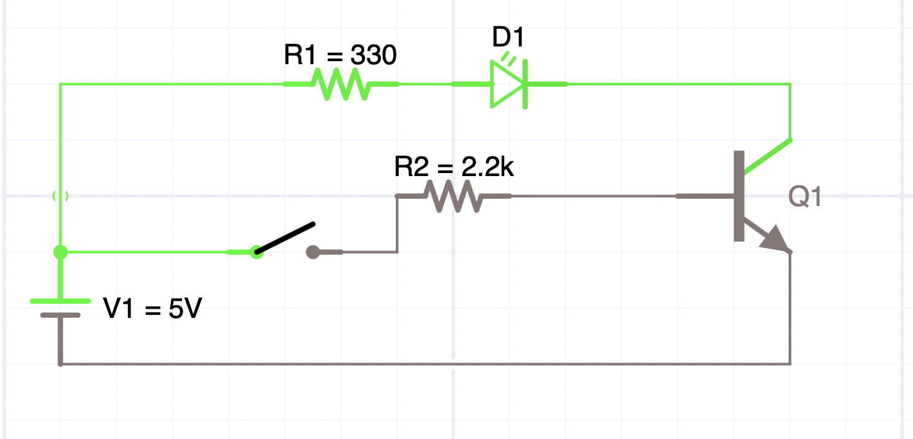
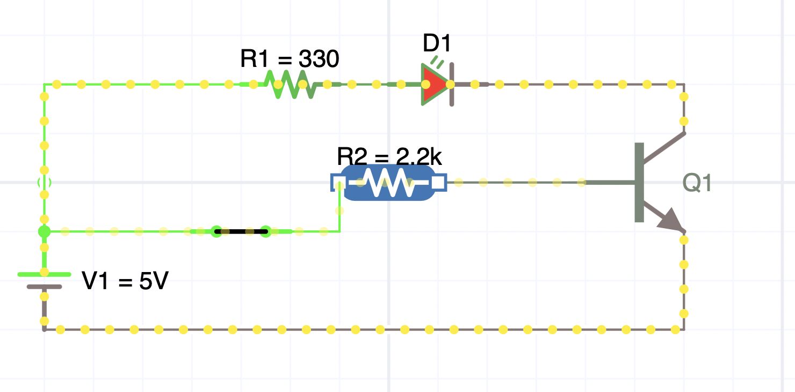
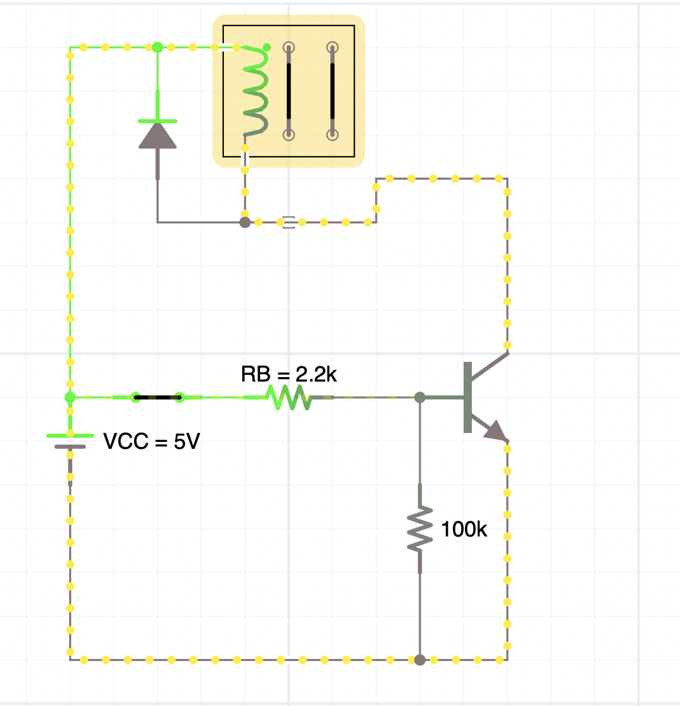

# EXPERIENCIA No. A02

# TRANSISTOR BJT COMO INTERRUPTOR – CORTE, SATURACIÓN Y CONTROL DE CARGA

**Asignatura:** Electrónica Analógica y Digital  
**Periodo:** 2026-2  
**Programa:** Ingeniería Eléctrica

---

## 1. PROPÓSITO

Comprobar experimentalmente cómo una pequeña corriente de base permite controlar una corriente mayor en el colector de un transistor BJT NPN, identificando de manera práctica las regiones de **corte** y **saturación**.

La práctica se concentra en lo esencial para la asignatura: utilizar el BJT como interruptor electrónico, medir voltajes, calcular corrientes, observar el efecto de la resistencia de base y aplicar un diodo de protección cuando se controla una carga inductiva.

> Esta práctica no incluye amplificación en emisor común. El objetivo es consolidar primero el uso del BJT como dispositivo de conmutación.

---

## 2. OBJETIVOS

Al finalizar la práctica el estudiante deberá ser capaz de:

- identificar base, colector y emisor mediante la hoja de datos;
- reconocer corte y saturación a partir de `VBE` y `VCE`;
- calcular la corriente de base `IB`;
- estimar la corriente de colector `IC` a partir de una medición de voltaje;
- comprobar que la resistencia de base controla el grado de excitación del transistor;
- explicar por qué una carga inductiva necesita un diodo de protección;
- comparar cálculo, medición y simulación.

---

## 3. FUNDAMENTO MÍNIMO

Para un transistor NPN utilizado como interruptor:

### Corte

La base no recibe excitación suficiente.

```text
IB ≈ 0
IC ≈ 0
VCE ≈ VCC
```

La carga permanece apagada.

### Saturación

La base recibe suficiente corriente y el transistor se comporta aproximadamente como un interruptor cerrado.

```text
VBE ≈ 0,6 a 0,8 V
VCE(sat) ≈ 0,1 a 0,3 V
```

La corriente de colector deja de estar determinada principalmente por `β` y queda limitada por la fuente y la carga.

### Relaciones que se utilizarán

```text
IB = (VIN - VBE) / RB
```

Esta expresión supone que no hay una resistencia adicional entre base y emisor. Si se conecta `RBE = 100 kΩ`, parte de la corriente de `RB` circula por ella. Con el control activado:

```text
IB = (VIN - VBE) / RB - VBE / RBE
```

Para calcular la corriente del LED sin abrir el circuito con el amperímetro:

```text
IC ≈ VRLED / RLED
```

Y:

```text
IE ≈ IB + IC
```

Como comprobación conceptual en región activa:

```text
IC ≈ β · IB
```

En saturación esta última relación ya no debe utilizarse para afirmar que la corriente seguirá aumentando indefinidamente.

---

## 4. SEGURIDAD

- Trabajar únicamente con baja tensión DC, preferiblemente `5 V`.
- Verificar el pinout exacto del transistor utilizado; un `2N2222`, `PN2222` y `BC547` no necesariamente comparten la misma distribución física de terminales.
- Nunca conectar la base directamente a la fuente: utilizar siempre resistencia de base.
- Apagar la fuente antes de modificar el protoboard.
- Verificar polaridad del LED y del diodo de protección.
- No conectar motores, relés ni otras cargas de potencia directamente a una señal de control.

---

## 5. MATERIALES

### Para las dos experiencias físicas

- 1 transistor BJT NPN: `2N2222`, `PN2222`, `BC547` o equivalente.
- 1 LED.
- 1 resistencia de `330 Ω` para el LED.
- Resistencias de base: `100 kΩ`, `10 kΩ` y `2,2 kΩ`.
- 1 resistencia de `100 kΩ` para mantener la base en cero, opcional.
- 1 interruptor o pulsador.
- Protoboard y cables.
- Fuente DC de `5 V`.
- Multímetro digital.

### Para la experiencia simulada

- Multisim, Proteus, Tinkercad Circuits, Falstad o simulador equivalente.
- BJT NPN.
- Motor DC pequeño o relé.
- Diodo `1N4007` o equivalente.
- Resistencia de base de `2,2 kΩ` y resistencia base-emisor de `100 kΩ` para el circuito de referencia con relé.

---

## 6. PRELABORATORIO – 10 MINUTOS

Antes de energizar:

1. Consulte la referencia del transistor disponible.
2. Identifique físicamente `B`, `C` y `E`.
3. Registre el pinout.
4. Para `VIN = 5 V` y `RB = 2,2 kΩ`, estime `IB` suponiendo `VBE = 0,7 V`.
5. Para un LED con `VF ≈ 2 V`, `RLED = 330 Ω` y `VCE(sat) ≈ 0,2 V`, estime la corriente máxima de colector.

### Cálculos esperados de referencia

```text
IB ≈ (5 - 0,7) / 2200 ≈ 1,95 mA
```

```text
IC(máx) ≈ (5 - 2 - 0,2) / 330 ≈ 8,5 mA
```

Estos valores son aproximados. Deben compararse con el transistor y LED reales.

---

# EXPERIENCIA 1 – BJT COMO INTERRUPTOR

## 7. OBJETIVO

Observar directamente los dos estados que interesan en conmutación: **corte** y **saturación**.

## 7.1 Circuito

Conecte:

```text
+5 V → 330 Ω → LED → colector
emisor → GND
+5 V → interruptor → 2,2 kΩ → base
```

Opcionalmente conecte `100 kΩ` entre base y GND para asegurar que la base quede en cero cuando el interruptor esté abierto.

### Figuras de referencia para las experiencias físicas

Las siguientes imágenes son esquemas aportados por el docente para guiar el montaje físico con LED de las Experiencias 1 y 2; no sustituyen las mediciones ni la fotografía del protoboard. En ambas, `R1 = RLED = 330 Ω` y `R2 = RB = 2,2 kΩ`. La resistencia base-emisor opcional no aparece dibujada.



**Figura 1. BJT en corte, interruptor abierto.** Observe que la excitación de base está interrumpida y el LED permanece apagado. Compruebe en el montaje que `IB` e `IC` son prácticamente nulas y registre `VBE` y `VCE`; contraste este estado con el de la Figura 2. Los colores del simulador no sustituyen las mediciones.



**Figura 2. BJT en conducción, interruptor cerrado.** Observe el camino de corriente desde `+5 V`, a través de `R1` y el LED, hasta el colector y el emisor; `R2` limita la corriente de base. El LED encendido evidencia conducción, pero no demuestra por sí solo saturación: mida `VCE` y compárelo con `VCE(sat)` de la hoja de datos para las condiciones de `IC` e `IB` utilizadas. El intervalo `0,1–0,3 V` es solo una referencia orientativa.

## 7.2 Procedimiento

### Estado A – Interruptor abierto

1. Energice el circuito.
2. Observe el LED.
3. Mida `VBE`.
4. Mida `VCE`.
5. Identifique la región de operación.

### Estado B – Interruptor cerrado

1. Cierre el interruptor.
2. Observe el LED.
3. Mida `VBE`.
4. Mida `VCE`.
5. Mida el voltaje sobre la resistencia de `330 Ω`.
6. Calcule `IC` mediante:

```text
IC ≈ VRLED / 330 Ω
```

7. Calcule `IB` utilizando el valor medido de `VBE`.
8. Calcule aproximadamente `IE = IB + IC`.
9. Determine si el transistor está en saturación.

## 7.3 Tabla de resultados

| Estado | VBE | VCE | VRLED | IB calculada | IC calculada | LED | Región |
|---|---:|---:|---:|---:|---:|---|---|
| Interruptor abierto | | | | | | | |
| Interruptor cerrado | | | | | | | |

## 7.4 Preguntas

1. ¿Por qué el LED está apagado cuando `IB ≈ 0`?
2. ¿Qué valor de `VCE` indica que el transistor se aproxima a un interruptor cerrado?
3. Compare `IB` e `IC`. ¿Cuál es mayor?
4. ¿De dónde proviene realmente la energía que enciende el LED: de la base o de la fuente de `5 V`?

---

# EXPERIENCIA 2 – EFECTO DE LA RESISTENCIA DE BASE

## 8. OBJETIVO

Comprobar que reducir `RB` aumenta la excitación de base hasta que el transistor llega a saturación.

## 8.1 Procedimiento

Mantenga el mismo circuito de la Experiencia 1. Sustituya únicamente la resistencia de base.

Use la [Figura 1 — LED en corte](assets/usuario/01-bjt-interruptor-led-corte.png) y la [Figura 2 — LED en conducción](assets/usuario/02-bjt-interruptor-led-conduccion.png) como referencias de comparación. Para ensayar cada `RB`, mantenga el interruptor **cerrado** y cambie `R2`, no `R1 = 330 Ω`. Observe cómo varían el brillo del LED, `IB`, `IC` y `VCE`; un LED encendido también puede corresponder a región activa. Si instaló la resistencia base-emisor de `100 kΩ`, consérvela fija y tenga en cuenta su corriente al calcular `IB`.

Utilice:

```text
RB = 100 kΩ
RB = 10 kΩ
RB = 2,2 kΩ
```

Para cada resistencia:

1. Antes de energizar, prediga si el LED estará apagado, tenue o encendido normalmente.
2. Mida `VBE`.
3. Mida `VCE`.
4. Mida `VRLED`.
5. Calcule `IB`.
6. Calcule `IC ≈ VRLED / 330 Ω`.
7. Determine si el transistor está en corte, activa o saturación.

## 8.2 Tabla de resultados

| RB | Predicción | VBE | VCE | IB | IC | Estado del LED | Región |
|---:|---|---:|---:|---:|---:|---|---|
| 100 kΩ | | | | | | | |
| 10 kΩ | | | | | | | |
| 2,2 kΩ | | | | | | | |

## 8.3 Análisis

1. ¿Qué ocurre con `IB` cuando disminuye `RB`?
2. ¿Qué ocurre con `VCE` a medida que aumenta la excitación de base?
3. ¿Llega un punto en que aumentar `IB` produce muy poco aumento adicional de `IC`? Explique.
4. ¿Cuál de los tres valores de `RB` produjo el comportamiento más cercano a saturación?

---

# EXPERIENCIA 3 – SIMULACIÓN: CONTROL DE UNA CARGA INDUCTIVA

## 9. OBJETIVO

Aplicar el BJT como interruptor para un motor DC pequeño o un relé y explicar la función del diodo de protección.

Esta experiencia se realiza **solo en simulación**.

## 9.1 Circuito

Implemente una configuración de lado bajo:

```text
+V → motor o bobina de relé → colector del BJT
emisor → GND
señal de control → RB → base
```

Conecte un diodo en paralelo con la carga inductiva:

```text
cátodo → +V
ánodo → colector
```

El diodo debe permanecer normalmente polarizado en inversa mientras la carga está energizada.

### Circuito de referencia con relé



**Figura 3. Experiencia simulada: relé con diodo de rueda libre.** Observe la bobina entre `+5 V` y el colector, el emisor al negativo común, `RB = 2,2 kΩ` en serie con el control y la resistencia de `100 kΩ` entre base y emisor. Al cerrar el interruptor, compruebe la corriente de bobina y el cambio de estado de los contactos del relé; mida `VCE` para verificar la saturación. Al abrirlo, la resistencia de `100 kΩ` evita que la base quede flotante y el diodo proporciona un camino para la corriente de la bobina mientras disminuye, limitando el pico de voltaje sobre el transistor.

Reproduzca los valores mostrados para esta referencia. El cátodo del diodo va a `+5 V` y el ánodo al colector; no lo conecte en serie con la bobina. La captura muestra la configuración con el control cerrado, no el transitorio de apagado: para estudiar este último use el osciloscopio o la gráfica temporal del simulador, según el procedimiento siguiente. Esta figura corresponde únicamente a la Experiencia 3, **solo en simulación**.

## 9.2 Procedimiento

1. Simule el circuito con el diodo instalado.
2. Active y desactive la base.
3. Registre `VBE`, `VCE` y corriente de carga.
4. Compruebe que el BJT funciona como interruptor.
5. Explique qué ocurre con la energía almacenada en la inductancia cuando se apaga el transistor.
6. Retire el diodo únicamente en la simulación y observe, cuando el simulador lo permita, el transitorio de voltaje.
7. Vuelva a instalar el diodo y compare.

## 9.3 Evidencia

Adjunte dos capturas:

- carga activada;
- circuito durante la desactivación o comparación con/sin diodo.

## 9.4 Preguntas

1. ¿Por qué el diodo está invertido durante la operación normal?
2. ¿Qué intenta hacer la corriente de una carga inductiva cuando se interrumpe de forma brusca?
3. ¿Qué componente queda protegido por el diodo?
4. ¿Qué relación existe entre esta experiencia y los diodos estudiados anteriormente en el curso?

---

## 10. INFORME DE LABORATORIO – FORMATO CORTO

El informe debe ser breve. No se requiere copiar teoría extensa.

### Portada

- integrantes;
- grupo;
- fecha;
- transistor utilizado.

### Experiencia 1

- esquema;
- cálculos previos;
- tabla completa;
- una fotografía del montaje;
- respuestas de análisis.

### Experiencia 2

- tabla completa;
- comentario sobre `RB` frente a `VCE`;
- respuestas de análisis.

### Experiencia 3

- dos capturas del simulador;
- explicación del diodo de protección.

### Conclusiones

Máximo **tres conclusiones técnicas**, redactadas con base en lo observado y medido.

---

## 11. RETO DE INGENIERÍA

Un sistema entrega una señal de control de `5 V` y debe encender una carga que consume aproximadamente `40 mA` mediante un BJT NPN.

Proponga una resistencia de base razonable para utilizar el transistor como interruptor. Justifique:

- corriente de base seleccionada;
- valor comercial de la resistencia;
- estado esperado del transistor;
- necesidad o no de diodo de protección según el tipo de carga.

No existe una única respuesta válida: se evalúa la justificación.

---

## 12. CRITERIO DE CIERRE

Al terminar la práctica, cada estudiante debe poder explicar sin fórmulas largas:

> **Una corriente pequeña en la base permite controlar una corriente mayor en el colector. Para utilizar el BJT como interruptor buscamos dos estados: corte y saturación.**

Esta idea servirá como punto de comparación para introducir posteriormente el transistor MOSFET, cuyo terminal de control es la compuerta y cuyo comportamiento de entrada es diferente al del BJT.

---

## 13. REFERENCIA PRINCIPAL

Boylestad, R. L. y Nashelsky, L., *Electrónica: teoría de circuitos y dispositivos electrónicos*, 10.ª edición.

- Capítulo 3: transistor bipolar de unión.
- Capítulo 4: polarización de cd de los BJT.
- Sección 4.15: redes de conmutación con transistores.
- Sección 4.16: técnicas de solución de fallas.
