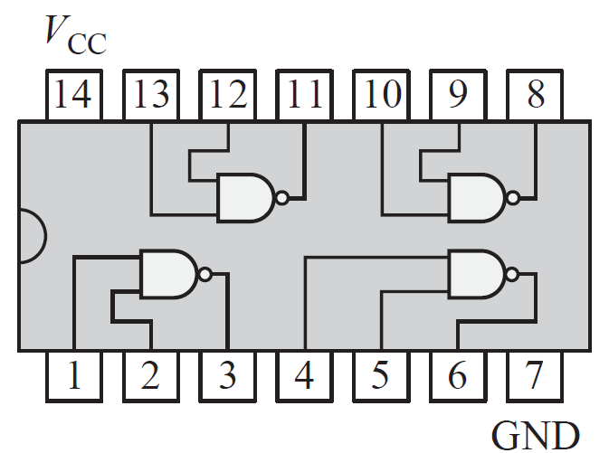
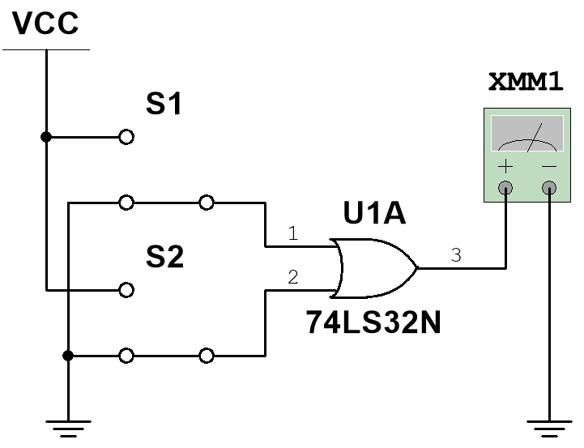
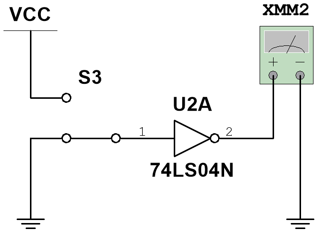
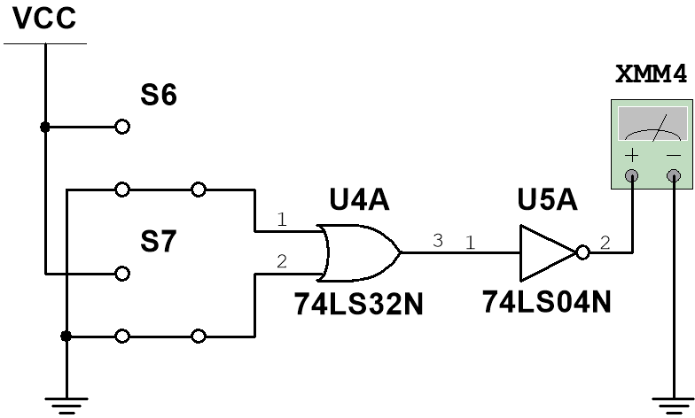
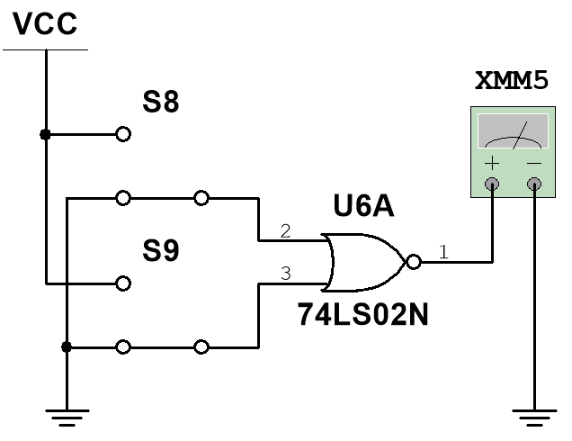
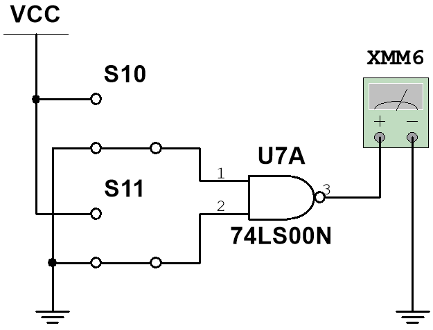
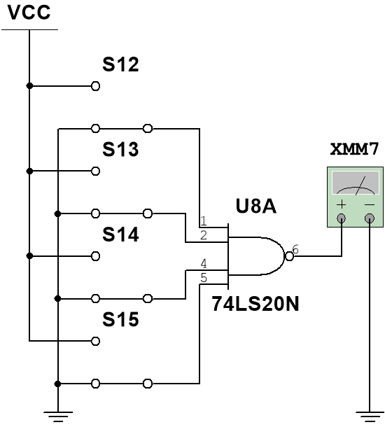
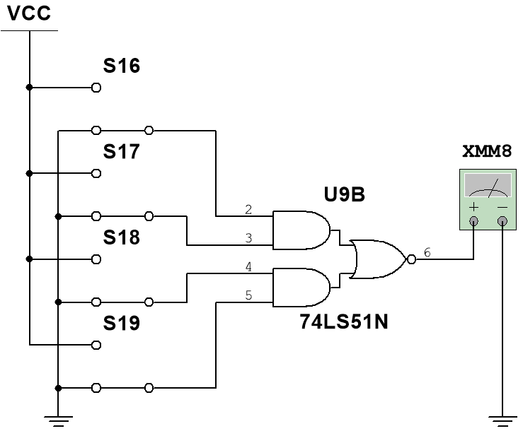
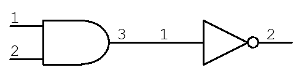
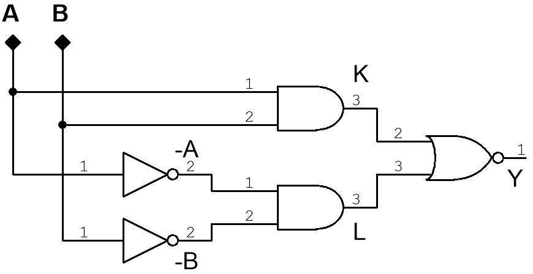

# EXPERIENCIA No. 1

# COMPUERTAS LÓGICAS

**Asignatura:** Sistemas Digitales · Electrónica Analógica y Digital

**Programa:** Ingeniería Eléctrica

**Modalidad:** montaje y simulación

## 1. Propósito

En esta experiencia se aplican combinaciones de entrada a compuertas OR, NOT, AND, NOR y NAND. Para cada combinación se mide la tensión de salida, se determina el estado lógico y se compara el comportamiento de una compuerta construida con dos integrados con el de su equivalente en un solo integrado. Después se simulan una NAND de cuatro entradas y una compuerta AND-OR-Invert.

Los estados `0` y `1` no son valores universales de tensión. Los integrados TTL de esta práctica se alimentan con `VCC = 5 V`; una salida lógica alta no tiene por qué medir exactamente `5 V`, ni una salida baja exactamente `0 V`. Consulte la hoja de datos del componente instalado antes de interpretar una lectura.

**Objetivos**

- Identificar los pines de alimentación, entrada y salida de los circuitos integrados.
- Comprobar experimentalmente las funciones AND, OR, NOT, NAND y NOR mediante sus tablas de verdad.
- Distinguir el estado lógico de la tensión medida con el multímetro.
- Comparar NOR implementada como OR seguida de NOT con la compuerta NOR integrada.
- Analizar en simulación compuertas de cuatro entradas y una configuración AND-OR-Invert.

## 2. Conceptos y orientación del integrado

Una tabla de verdad muestra todas las combinaciones posibles de entrada y la salida lógica correspondiente. Una compuerta **AND** entrega `1` cuando todas sus entradas son `1`; **OR**, cuando al menos una es `1`; **NOT** invierte su entrada; **NAND** y **NOR** invierten, respectivamente, las salidas de AND y OR.

La figura 1 muestra la vista superior de un integrado de 14 terminales. La muesca señala el extremo donde se encuentran los pines 1 y 14; la numeración avanza alrededor del encapsulado en sentido antihorario. En los integrados de 14 pines **utilizados aquí**, el pin 14 corresponde a `VCC` y el 7 a `GND`. Verifique el modelo real y su hoja de datos; la disposición de entradas y salidas cambia entre referencias.

*Figura 1. Vista superior del CI 7400; se conserva el dibujo de la guía original.*

| Entrada A | Entrada B | Salida lógica NAND esperada | Tensión de salida medida (V) | Estado lógico observado |
|---:|---:|:---:|:---:|:---:|
| 0 | 0 |  |  |  |
| 0 | 1 |  |  |  |
| 1 | 0 |  |  |  |
| 1 | 1 |  |  |  |

*Tabla 1. Predicción inicial de la compuerta NAND del CI 7400. Complete la salida esperada antes del montaje.*

## 3. Seguridad y recursos

Utilice únicamente una fuente de **5 V DC regulados** para los CI TTL indicados. Con la fuente apagada, revise el pinout, la orientación del integrado y la continuidad de los rieles de la protoboard. Mida la salida de la fuente antes de conectar `VCC`; conecte la alimentación del CI al final y desconéctela antes de modificar el cableado. No conecte una entrada a `VCC` y `GND` al mismo tiempo ni deje sin definir las entradas que intervienen en la función. Si un componente se calienta o huele de forma anormal, apague la fuente. Siga además el reglamento y los elementos de protección del laboratorio.

**Materiales y equipos:** protoboard, cables, fuente DC regulada, multímetro, conmutadores o puentes para fijar cada entrada a `VCC` o `GND`, e integrados 7432/74LS32, 7404/74LS04, 7408/74LS08, 7402/74LS02 y 7400/74LS00. Para simulación: 7420/74LS20 y 7451/74LS51, o sus modelos equivalentes. La guía original incluye resistencias de `5,6 kΩ`, que pueden utilizarse donde el montaje o el simulador requieran fijar una entrada; confirme su función y no las use como sustituto de verificar el estado eléctrico de un pin. Si utiliza indicadores LED, añada una resistencia limitadora calculada para el LED y la capacidad de salida del CI.

> **Antes de medir:** anote el fabricante y la referencia exacta de cada integrado, y consulte su hoja de datos. Los dibujos son esquemas de la función, no sustituyen la comprobación de pines, alimentación y límites eléctricos del dispositivo disponible.

| Integrado utilizado | Fabricante y referencia exacta | Pin VCC | Pin GND | Entradas/salida de la puerta usada |
|---|---|---:|---:|---|
| OR (7432/74LS32) |  |  |  |  |
| NOT (7404/74LS04) |  |  |  |  |
| AND (7408/74LS08) |  |  |  |  |
| NOR (7402/74LS02) |  |  |  |  |
| NAND (7400/74LS00) |  |  |  |  |

## 4. Procedimiento experimental

1. Identifique en las hojas de datos las entradas, salidas, `VCC` y `GND` de cada CI. Coloque el integrado con la muesca orientada de forma que pueda reconocer el pin 1.
2. Con la alimentación desconectada, arme un solo circuito a la vez. Cada entrada que se pruebe debe quedar unida claramente a `0 V` o a `5 V`; compruebe que el conmutador no cortocircuite la fuente.
3. Verifique el cableado, conecte `GND` y `VCC`, y mida la tensión real de alimentación.
4. Para cada fila de la tabla, establezca las entradas, mida la salida respecto de `GND` y anote tanto la tensión en voltios como el estado lógico observado. Repita para todas las combinaciones.
5. Apague la fuente antes de pasar al siguiente circuito. Conserve fotos o capturas de los montajes para el informe.

### Circuito 1 · OR, CI 7432/74LS32

*Figura 2. Compuerta OR. En la puerta A, entradas pines 1 y 2; salida pin 3.*

| Pin 1 (A) | Pin 2 (B) | Salida lógica esperada | Salida medida (V) | Estado observado |
|---:|---:|:---:|:---:|:---:|
| 0 | 0 |  |  |  |
| 0 | 1 |  |  |  |
| 1 | 0 |  |  |  |
| 1 | 1 |  |  |  |

*Tabla 2. Compuerta OR.*

### Circuito 2 · NOT, CI 7404/74LS04

*Figura 3. Inversor NOT. En la puerta A, entrada pin 1 y salida pin 2.*

| Pin 1 (A) | Salida lógica esperada | Salida medida (V) | Estado observado |
|---:|:---:|:---:|:---:|
| 0 |  |  |  |
| 1 |  |  |  |

*Tabla 3. Inversor NOT.*

### Circuito 3 · AND, CI 7408/74LS08

*Figura 4. Compuerta AND. En la puerta A, entradas pines 1 y 2; salida pin 3.*

| Pin 1 (A) | Pin 2 (B) | Salida lógica esperada | Salida medida (V) | Estado observado |
|---:|---:|:---:|:---:|:---:|
| 0 | 0 |  |  |  |
| 0 | 1 |  |  |  |
| 1 | 0 |  |  |  |
| 1 | 1 |  |  |  |

*Tabla 4. Compuerta AND.*

### Circuito 4 · OR seguida de NOT, CI 7432 y 7404

*Figura 5. Implementación de NOR con dos integrados. La salida pin 3 de la OR llega a la entrada pin 1 del inversor; la salida final está en el pin 2 de este.*

| A (OR pin 1) | B (OR pin 2) | Salida lógica esperada | Salida final medida (V) | Estado observado |
|---:|---:|:---:|:---:|:---:|
| 0 | 0 |  |  |  |
| 0 | 1 |  |  |  |
| 1 | 0 |  |  |  |
| 1 | 1 |  |  |  |

*Tabla 5. OR + NOT.*

### Circuito 5 · NOR, CI 7402/74LS02

*Figura 6. Compuerta NOR integrada. En la puerta A, entradas pines 2 y 3; salida pin 1.*

| Pin 2 (A) | Pin 3 (B) | Salida lógica esperada | Salida medida (V) | Estado observado |
|---:|---:|:---:|:---:|:---:|
| 0 | 0 |  |  |  |
| 0 | 1 |  |  |  |
| 1 | 0 |  |  |  |
| 1 | 1 |  |  |  |

*Tabla 6. Compuerta NOR. Compare sus estados lógicos con los de la tabla 5.*

### Circuito 6 · NAND, CI 7400/74LS00

*Figura 7. Compuerta NAND. En la puerta A, entradas pines 1 y 2; salida pin 3.*

| Pin 1 (A) | Pin 2 (B) | Salida lógica esperada | Salida medida (V) | Estado observado |
|---:|---:|:---:|:---:|:---:|
| 0 | 0 |  |  |  |
| 0 | 1 |  |  |  |
| 1 | 0 |  |  |  |
| 1 | 1 |  |  |  |

*Tabla 7. Compuerta NAND.*

## 5. Simulación de circuitos

Repita las conexiones de las figuras 8 y 9 en el simulador disponible. Para cada fila, registre la salida simulada y adjunte al informe por lo menos una captura de pantalla de cada circuito. Compruebe también que el modelo del simulador emplee la misma función y numeración de pines que el integrado seleccionado.

### Circuito A · NAND de cuatro entradas, CI 7420/74LS20

*Figura 8. NAND de cuatro entradas. En la primera puerta, entradas pines 1, 2, 4 y 5; salida pin 6.*

| Pin 1 | Pin 2 | Pin 4 | Pin 5 | Salida lógica esperada | Salida simulada (V) | Estado simulado |
|---:|---:|---:|---:|:---:|:---:|:---:|
| 0 | 0 | 0 | 0 |  |  |  |
| 1 | 0 | 0 | 0 |  |  |  |
| 1 | 1 | 0 | 0 |  |  |  |
| 1 | 1 | 1 | 0 |  |  |  |
| 1 | 1 | 1 | 1 |  |  |  |

*Tabla 8. Combinaciones propuestas en la guía original. Para comprobar completamente la función existen 16 combinaciones; añada las otras 11 si se solicita una tabla exhaustiva.*

### Circuito B · AND-OR-Invert, CI 7451/74LS51

*Figura 9. Puerta AND-OR-Invert de cuatro entradas. Para la sección mostrada, entradas pines 2, 3, 4 y 5; salida pin 6. Exprese la función a partir de las dos ramas AND y la inversión de su suma OR.*

| Combinación | Pin 2 | Pin 3 | Pin 4 | Pin 5 | Salida lógica esperada | Salida simulada (V) | Estado simulado |
|---:|---:|---:|---:|---:|:---:|:---:|:---:|
| 1 | 0 | 0 | 0 | 0 |  |  |  |
| 2 | 1 | 0 | 0 | 0 |  |  |  |
| 3 | 1 | 1 | 0 | 0 |  |  |  |
| 4 | 1 | 1 | 1 | 0 |  |  |  |
| 5 | 1 | 1 | 1 | 1 |  |  |  |

*Tabla 9. Combinaciones propuestas en la guía original. Para una verificación completa también se requieren 16 combinaciones.*

## 6. Análisis y cálculos

Compare primero **estados lógicos**: la salida esperada de cada tabla frente a la salida observada. Registre cualquier diferencia y revise alimentación, pines, conexiones, entradas flotantes y modelo del simulador. Después compare las **tensiones** medidas con los límites eléctricos indicados en la hoja de datos del CI utilizado.

La tabla de verdad no proporciona una tensión teórica exacta. Por eso, no corresponde calcular un «error porcentual» usando `0` o `1` como si fueran voltios, ni dividir por una referencia de `0 V`. Si dispone de una tensión de referencia válida para la condición de medida, identifíquela explícitamente y podrá calcular `error % = |Vmedida − Vreferencia| / |Vreferencia| × 100`, siempre que `Vreferencia ≠ 0`. Para esta práctica, la comparación principal es la concordancia lógica y el cumplimiento de los límites del fabricante.

| Circuito y fila | Tensión medida o simulada (V) | Estado esperado | Estado observado | ¿Coinciden? | Posible explicación si no coinciden |
|---|---:|:---:|:---:|:---:|---|
|  |  |  |  |  |  |
|  |  |  |  |  |  |
|  |  |  |  |  |  |

## 7. Cuestionario

1. ¿Qué significa TTL en los circuitos integrados de esta práctica?
2. ¿Qué otras familias o tecnologías lógicas existen? Explique al menos dos y una diferencia relevante para su alimentación o nivel de entrada.
3. A partir de la tabla 3, explique qué hace un inversor.
4. Complete la tabla 10 para la configuración AND seguida de NOT de la figura 10. Indique en la columna intermedia la salida de AND y en la última la salida final.

*Figura 10. Configuración AND–NOT.*

| A | B | Salida AND | Salida final NOT |
|---:|---:|:---:|:---:|
| 0 | 0 |  |  |
| 0 | 1 |  |  |
| 1 | 0 |  |  |
| 1 | 1 |  |  |

*Tabla 10. Análisis de AND seguida de NOT.*

5. Complete la tabla 11 siguiendo cada conexión de la figura 11. Escriba la expresión de `K`, `L` y `Y` a partir del diagrama; después verifique los cuatro casos.

*Figura 11. Configuración de NOT, AND y NOR. `K` y `L` son las salidas intermedias.*

| A | B | ¬A | ¬B | K | L | Y |
|---:|---:|:---:|:---:|:---:|:---:|:---:|
| 0 | 0 |  |  |  |  |  |
| 0 | 1 |  |  |  |  |  |
| 1 | 0 |  |  |  |  |  |
| 1 | 1 |  |  |  |  |  |

*Tabla 11. Análisis de la configuración de la figura 11.*

## 8. Entrega

Presente las tablas 1 a 11 completas, las referencias exactas de los integrados, las tensiones medidas, fotos de los montajes, por lo menos una captura de cada simulación, la comparación entre teoría y medición, las respuestas al cuestionario y conclusiones propias. Puede usar el [informe editable](informe-lab-01-compuertas-logicas.html) para llenar las tablas en el navegador, guardar su avance y descargar una copia con sus respuestas.

## Referencias

- Guía suministrada por el docente: *Experiencia de laboratorio #1 – Compuertas lógicas*, Universidad de la Costa. Se conservaron sus once figuras de circuitos y sus actividades principales.
- Texas Instruments: [SN74LS00](https://www.ti.com/lit/ds/symlink/sn74ls00.pdf), [SN74LS02](https://www.ti.com/lit/ds/symlink/sn74ls02.pdf), [SN74LS20](https://www.ti.com/lit/ds/symlink/sn74ls20.pdf) y [SN74LS51](https://www.ti.com/lit/ds/symlink/sn74ls51.pdf). Verifique además las hojas de datos de los integrados efectivamente utilizados.
- Boylestad, R. L. y Nashelsky, L. (2012). *Electrónica: teoría de circuitos y dispositivos electrónicos*. Pearson.
- Hayt, W. H., Kemmerly, J. E. y Durbin, S. M. (2012). *Análisis de circuitos en ingeniería*. McGraw-Hill.
