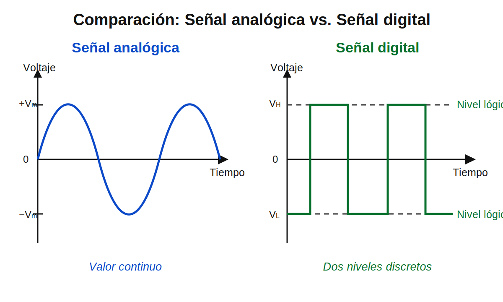

# Semana 02 – Señales, magnitudes eléctricas y medición

## Propósito

Diferenciar señales analógicas y digitales, relacionándolas con magnitudes eléctricas medibles y con aplicaciones reales de ingeniería eléctrica y electrónica.

## Marco teórico

- [Marco teórico – Señales, magnitudes eléctricas y medición](marco-teorico.md)

## Imagen de apoyo

## Desarrollo de la clase

- Señales continuas y discretas.
- Voltaje, corriente, resistencia y potencia.
- Referencia o tierra común en una medición.
- Niveles lógicos.
- Sensores y conversión de señales.
- Ejercicios guiados para identificar sistemas analógicos, digitales y mixtos.

## Entrega

Actividad comparativa sobre sistemas analógicos, digitales y mixtos.
