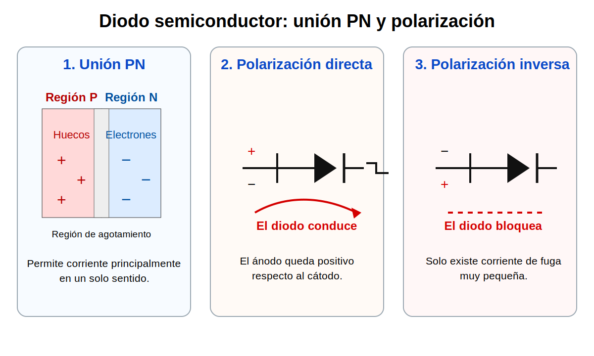

# Semana 02 – Semiconductores, diodos, rectificación básica y Zener

## Propósito

Comprender el comportamiento básico de los materiales semiconductores, la unión PN y el diodo, relacionando estos conceptos con LED, resistencia limitadora, rectificación básica y primera aproximación al diodo Zener.

## Marco teórico

- [Marco teórico – Señales, magnitudes eléctricas y medición](marco-teorico.md)
- [Marco teórico – Semana 03: semiconductores y unión PN](../semana-03-semiconductores-union-pn/marco-teorico.md)
- [Marco teórico – Semana 04: rectificación y filtrado](../semana-04-diodos-rectificacion/marco-teorico.md)

## Imágenes de apoyo

## Desarrollo de la clase

- Repaso corto de señales, polaridad y medición.
- Conductores, aislantes y semiconductores.
- Dopaje tipo P y tipo N.
- Unión PN.
- Diodo en polarización directa e inversa.
- Modelo práctico del diodo de silicio.
- LED y resistencia limitadora.
- Rectificación básica de media onda y puente rectificador.
- Filtro capacitivo como primera aproximación.
- Zener como elemento de regulación o protección.
- Inicio y orientación del Lab A01.

## Evaluación y entrega

- Taller integrador del Corte 1.
- Lab A01 – Diodos, rectificación y regulación con Zener.

## Relación con la siguiente clase

La siguiente semana se trabajará el transistor BJT como dispositivo de control. Por eso deben quedar claros ánodo, cátodo, polaridad, caída de voltaje, resistencia limitadora, rectificación y uso básico del Zener.
