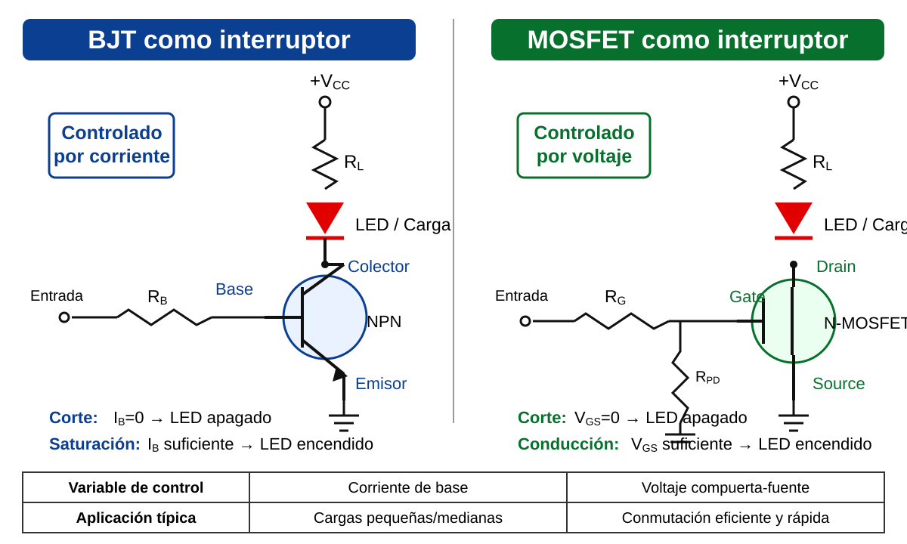

# Semana 03 – Transistor BJT y control de cargas

## Propósito

Analizar el transistor BJT como dispositivo de control y conmutación, aplicándolo en circuitos de activación de LED, relé o carga DC de baja potencia.

## Marco teórico

- [Marco teórico – Semana 03](marco-teorico.md)

## Imagen de apoyo

## Desarrollo de la clase

- Terminales y tipos NPN/PNP.
- Regiones de corte, activa y saturación.
- BJT como interruptor.
- Cálculo de resistencia de base.
- Corriente y potencia del transistor.
- Control de LED, relé o carga DC.
- Diodo de protección en cargas inductivas.
- Actualización de la arquitectura del proyecto ABPr.

## Laboratorio asociado

- [Lab A02 – Transistor BJT](../../guias-laboratorio/analogica/lab-a02-transistor-bjt/README.md)

## Evidencia ABPr

- Cálculo de resistencia de base.
- Simulación y mediciones.
- Hoja de datos consultada.
- Explicación del bloque controlado.
- Diagrama de bloques actualizado.

## Relación con la siguiente clase

La Semana 04 estudia el MOSFET como alternativa de control eficiente y cierra técnicamente la Fase 1.
