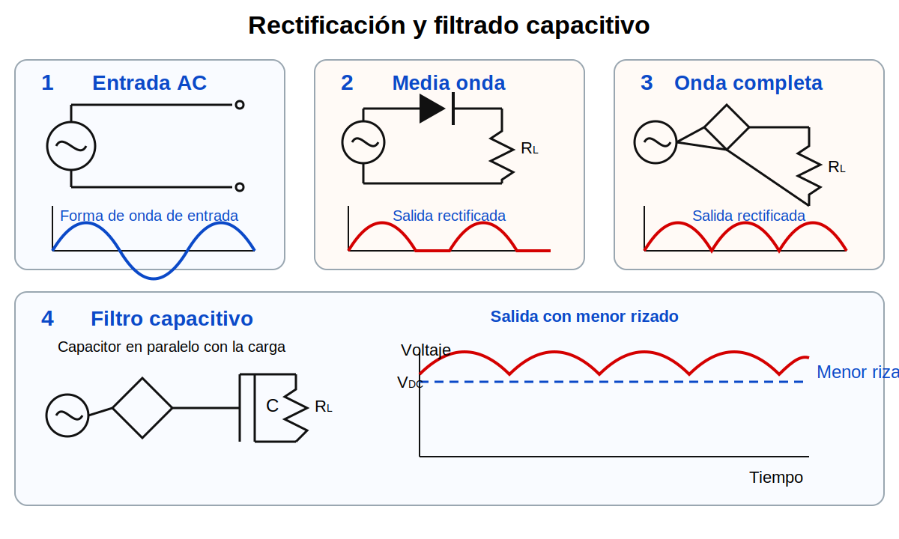
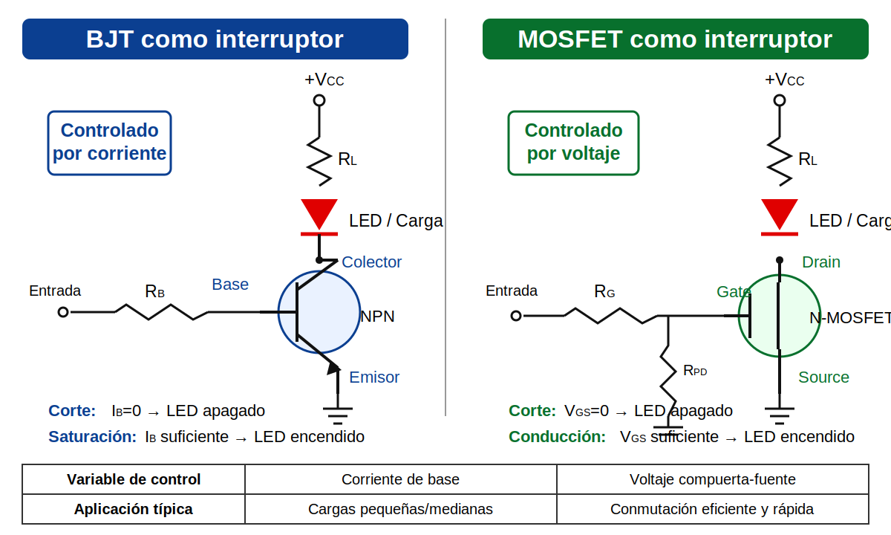

# Semana 04 – Rectificación, filtrado, LED, Zener, BJT y MOSFET

## Propósito

Cerrar los contenidos nuevos de la unidad analógica, relacionando el uso de diodos, LED, Zener, BJT y MOSFET con aplicaciones básicas de alimentación, regulación y control de cargas.

## Marco teórico

- [Marco teórico – Semana 04](marco-teorico.md)
- [Material de apoyo – BJT y MOSFET](../semana-05-cierre-analogico-bjt-fet-mosfet/marco-teorico.md)

## Imágenes de apoyo

## Desarrollo de la clase

- Rectificador de media onda.
- Rectificador de onda completa.
- Puente rectificador.
- Voltaje pico, RMS y promedio.
- Rizado y filtrado básico.
- LED y resistencia limitadora.
- Zener como regulador básico.
- BJT como interruptor.
- MOSFET como interruptor y control de carga.
- Relación entre diodos, Zener, BJT y MOSFET dentro de una aplicación analógica.

## Evaluación y entregas

- Quiz 1 – Unidad analógica.
- Taller 2 investigativo – Dispositivos semiconductores o aplicaciones analógicas.
- Desarrollo y evidencias de Lab A01.
- Orientación de Labs A02 y A03 como práctica, simulación o trabajo complementario.

## Relación con la siguiente semana

La siguiente semana se destinará al Parcial 1. No se programará tema nuevo.
